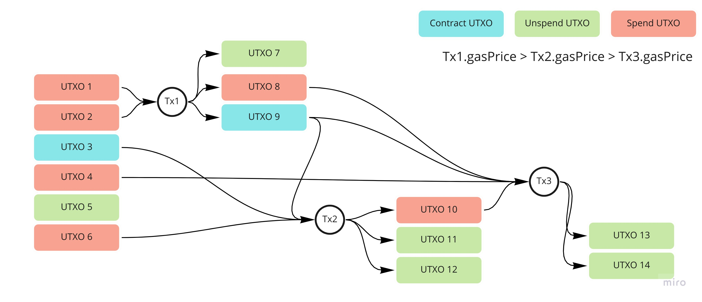

# TxPool

It contain list of transaction sorted by GasPrice, prepared to be included into new block. So when talking about gas it is important to make distinction between:

* GasPrice or just Price: represents amount that transaction is going to pay for unit of GasSpend
* GasSpend or just Gas: is amount of how much vm worked to execute this transaction.
* Tx GasLimit: how much transaction is willing to pay for execution. (GasLimit > GasPrice*GasSpend)
* Block GasLimit: How full can we get our block.  

Fuel as UTXO system depends on output and input of transaction and proving that child is *valid* and depends on some parent in transaction can be challenging. All transactions in pool are expected to be in some sense *valid* or better said has potential to be includable. This plays a big role on protection against spamming and on design of fuel txpool. We are building dependency structures that would describe those parent->child relationships.

From miro diagram we can see that txpool is used by:

* p2p subsystem: receive/broadcast new tx
* Block importer: clean included tx
* Block producer: take N number of transactions

All Tx should be wrapped inside Arc so that we can easily move them if there is need and so that they can be referenced in multiple places.

TxPool should be periodically flush to disk so that we can recover transactions is case of client restart. Omitted for first version.

TxPoolDb trait is interface that TxPool is going to implement and can be found [here](src/ports.rs)

## Design

We will need to have at least three structures that do sorting of tx.

* by hash: Ordinary HashMap, maps hash to Tx. For fast lookup.
* by PriceSort: sorted structure that sort all transaction by GasPrice. Most optimal structure can be `BinaryHeap` for fast sorting/inserting but it does have some downsides when we want to remove one item. For use case when a lot of tx are going to be removed we can just recreate structure from scratch. For first interaction we can use simple `BTreeMap` that sorts all inputs.
* by Dependency: With every fuel transaction, inputs and outputs change state and we need to be aware of it. Graph is the main defensive structure against DDoS attack, and every transaction that we include in pool should have potential to be included in next block. The graph represents connections between parent and child txs, where child depends on execution output of parent that is found inside database or transaction pool.

### Dependency graph

Few reasonings on decision and restrains made by txpool

Visualization of dependencies between three transactions:

Problem 1: T2 arriving before T1.

Solution: Have restriction that broadcast of hashes need to contain ancestor hashes and they all need to be sorted by gasPrice

Problem 2: if T2 gas price is higher then T1. This can be problematic on txpool with different sizes. One big enough pull could contains T1 but other one would prune it and we could not prove that T2 can be included without T1.

Solution: Have restriction on linked transaction within same block so that GasPrice is strictly going down. This will effect newly create contract (created in same block) but not old one.

Usage: Insertion of new T4

* Usage: inserting T4 that replaces T1. It is done if GasPrice(T4) > GasPrice(T1) and if there is some overlapping inputs between them AnyInput(T4) == AnyInput(T1).
* Usage: inserting T4 that use State6 and GasPrice(T4) > GasPrice(T3).
    Result: Remove T3 from txpool check every T3 child for removal. Check if any T that has lover gas is reusing T4 outputs so they should be connected to T4.

### Implementation

Graph will be needed for relationship between dependable transactions so that if one of them get included/removed/replaced we need to know what to do with their dependent children.
We will need map of all outputs in same structure so that we can fast search them. That would be something like `HashMap<UtxoId, CoinState>` and `HashMap<ContractId,ContractState>` for both Coin and Contract state.

### Block inclusion algorithm

It is most straightforward one: take PriceSort and iterate over transactions. DependencyGraph inclusion guarantees us that every transaction in the sorted array can be included, but only after executing those transactions we can be sure that is can be included in the block.

## Future work

Some things and ideas what we can add in future:

* Checks for `gas_limit*gas_price` for transactions with depth one (Tx where all inputs can be found in db).
* Add global max size of transaction in bytes. So that we can limit how big transaction can be found inside txpool.
* Allow transactions added from reverted block to have priority against other transactions.
* New economy model including multidimensional variables that decide on priority of transaction inclusion. For example, first variable can be byte_price (in rollup mode it has even more effect). Inspired by Vitalik's Multidimensional EIP-1559 post (<https://ethresear.ch/t/multidimensional-eip-1559/11651>)
* eip1559
* Have transaction that does not have contract input executed inside txpool.
* Have bucket of unconnected transaction that on every new transaction inclusion will add new outputs and check a bucket to see if there is some connected transactions that would become valid.

## refs

* Some information on OpenEthereum and restrictions on tx inclusion: <https://openethereum.github.io/Transactions-Queue>
* Possible out of scope, but it is relatively easy to add ethereum's eip1559 that adds Fee market change with basefee. More on eip1559: <https://hackmd.io/@timbeiko/1559-resources>
Erigon did good docs on impl of eip1559 txpool: <https://github.com/ledgerwatch/erigon/wiki/Transaction-Pool-Design>
