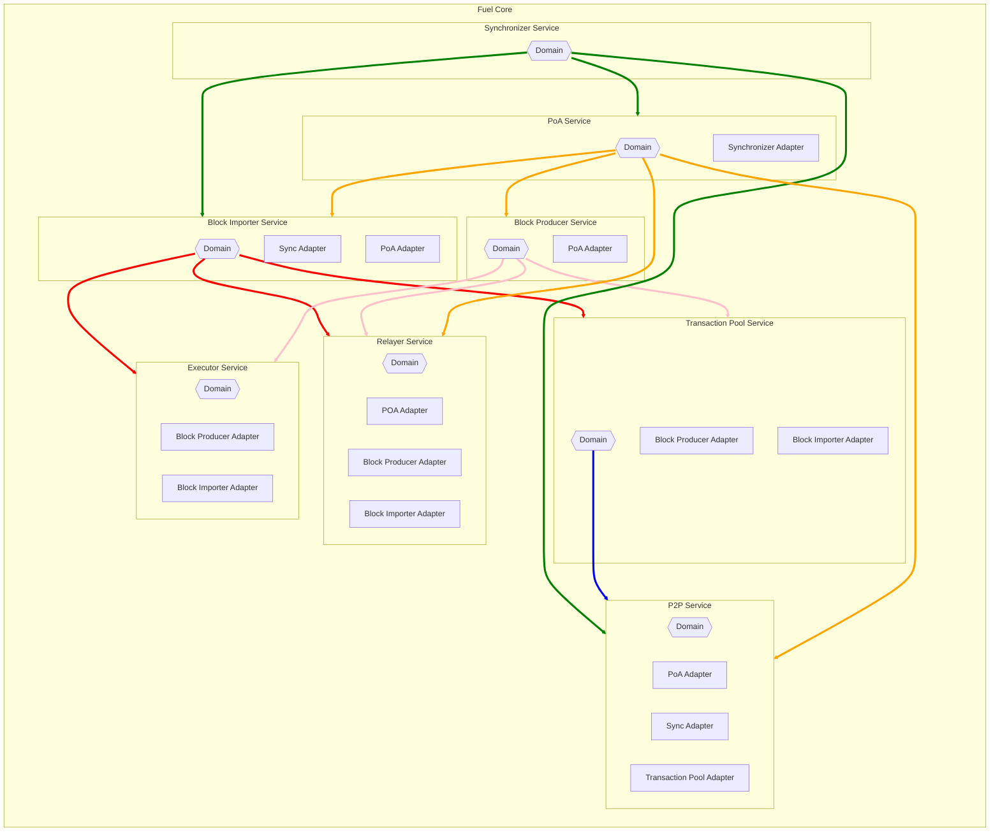

# Fuel Client Software Architecture

Inspired by [Hexagonal Architecture](https://en.wikipedia.org/wiki/Hexagonal_architecture_(software)), the Fuel 
blockchain client is composed of various domain modules. Each module defines its own view of the system 
via a class of traits we'll call "Ports". This is in contrast to creating globally shared interfaces
with the difficulty of trying to cover every possible use-case in a future-proof way, while on the other hand
leaking many irrelevant concerns across different domains. This approach may lead to a small amount of
monotonous and boring bloat in a few areas, but this is offset by the advantages of loose coupling.
This is intended to minimize the overall complexity and cognitive load of the codebase.
Business logic will have clear intentions and be easy to follow, unit tests don't need to mock low level details
about unrelated components, and refactors can easily control their blast radius.

In a system of shared global traits between modules, any updates to an interface will cause breaking changes
to the mocks and test harnesses for all consuming modules. This is less than ideal when these domain modules
don't need to use the new changes. However, in a system where each domain controls its ports, adjusting an
interface will only affect the port owner and the implementor.

The implementation of "Ports" (aka adapters) referring to other domain modules, should reside in the main fuel-core
crate. This way, domain modules should never need to take a dependency on each other. This helps to avoid circular
dependencies, and also allows for lightweight rapid developer iteration within a domain module. It also ensures
the purity of the domain modules, preventing implementation details of modules from contaminating each other. Adapters
are intended to restrict the viral spread of any ugly complexity that arises when integrating modules. Decisions
such as whether to use channels, networking, IPC, or direct calls between domain modules can be decided in the adapter
without any effect on the domain logic. They should avoid implementing any business rules, and only contain integration
glue logic between systems.

Special care was also taken in this design approach to keep implementation details regarding synchronization primitives
or proprietary async runtime requirements out of any public interfaces (No channels!).

## Domains:



### (PoA) Consensus Module

#### Ports: fuel_poa_consensus::ports
```rust
trait BlockProducer {
    // used by the PoA node to produce a new block and immediately save the resultant block state
    async fn produce_and_store_block(height: BlockHeight) -> Result<FuelBlock>;
}

trait BlockImporter {
    // used by non-poa nodes in response to blocks proposed via p2p
    async fn commit(sealed_block: SealedFuelBlock) -> Result<()>;
}

trait Relayer {
    // wait until the relayer eth node is synced
    async fn await_synced() -> Result<()>;
    // wait until the relayer reaches a desired da_height
    async fn await_da_height(da_height: DaHeight) -> Result<()>;
    // get the consensus key associated with a da_height
    async fn get_poa_key(da_height: DaHeight) -> Result<ConsensusKey>;
}

trait Database {
    // get the current fuel chain height
    fn get_current_height() -> Result<BlockHeight>;
    // insert consensus information associated with a sealed block that was locally produced
    fn insert_consensus_data(sealed_block: &SealedFuelBlock) -> Result<()>;
}

trait PeerToPeer {
    // broadcast a newly produced block to the network
    async fn broadcast_new_block(block: SealedFuelBlock) -> Result<()>;
    // receive a newly produced block from the network
    async fn on_new_block(block: SealedFuelBlock) -> Result<()>;
}
```
#### Adapters: fuel_core::service::adapters::poa_consensus
```rust
impl fuel_sync::ports::Consensus for Service<PoA> {
    // insert impl here
}
```

### Block Producer

#### Ports: fuel_block_producer::ports

```rust
trait TransactionPool {
    fn select_block_txs(max_gas: u64, block_height: BlockHeight) -> Result<Vec<Arc<CheckedTransaction>>>;
    fn drop_txs(txs: Vec<TxId>) -> Result<()>;
}

trait Executor {
    async fn produce_block(block: &mut FuelBlock) -> Result<()>;
}

trait Relayer {
    fn get_finalized_da_height() -> Result<DaHeight>;
}
```
#### Adapters: fuel_core::service::adapters::block_producer
```rust
impl fuel_poa_consensus::ports::BlockProducer for Service<BlockProducer> {
    // insert impl here
}
```

### Block Importer

#### Ports: fuel_block_importer::ports

```rust
trait Relayer {
    // wait until the relayer is synced with ethereum
    async fn await_synced() -> Result<()>;
    // wait until a specific da_height is reached
    async fn await_da_height(da_height: DaHeight) -> Result<()>;
}

trait Executor {
    async fn validate_and_store_block(block: &FuelBlock) -> Result<()>;
}

trait TransactionPool {
    // remove a set of txs from the pool after a block is committed
    fn drop_txs(txs: Vec<TxId>) -> Result<()>;
}

trait Database {
    // insert consensus information associated with a sealed block
    fn insert_consensus_data(sealed_block: &SealedFuelBlock) -> Result<()>;
}

```
#### Adapters: fuel_core::service::adapters::block_importer
```rust
impl fuel_poa_consensus::ports::BlockImporter for Service<BlockImporter> {
    // insert impl here
}

impl fuel_sync::ports::BlockImporter for Service<BlockImporter> {
    // insert impl here
}
```

### Synchronizer

#### Ports: fuel_sync::ports
```rust
trait PeerToPeer {
    async fn fetch_best_peer_height() -> Result<(PeerId, BlockHeight)>;
    async fn fetch_block_headers(query: Range<BlockHeight>) -> Result<Vec<(PeerId, SealedFuelBlockHeader)>>;
    async fn fetch_block_data(id: block_id) -> Result<Vec<(PeerId, FuelBlockBody)>>;
    async fn report_invalid_height(peer: PeerId) -> Result<()>;
    async fn report_invalid_block(peer: PeerId) -> Result<()>;
}

trait BlockImporter {
    // commit a sealed block to the chain
    async fn commit(block: SealedFuelBlock) -> Result<()>;
}

trait Consensus {
    // check with the consensus layer whether a block header passes consensus rules
    async fn validate_sealed_block_header(block: SealedFuelBlockHeader) -> Result<()>;
}

trait Database {
    // get current fuel blockchain height
    fn get_current_height() -> Result<BlockHeight>;
}
```
#### Adapters: fuel_core::service::adapters::fuel_sync
_N/A_

### P2P

#### Ports: fuel_p2p::ports
```rust
trait Database {
    // used when other peers are syncing
    fn get_sealed_block(height: BlockHeight) -> Result<SealedFuelBlock>; 
}
```

#### Adapters: fuel_core::service::adapters::peer_to_peer
```rust
impl fuel_poa_consensus::ports::PeerToPeer for Service<P2pService> {
    // insert impl here
}

impl fuel_sync::ports::PeerToPeer for Service<P2pService> {
    // insert impl here
}

impl fuel_txpool::ports::PeerToPeer for Service<P2pService> {
    // insert impl here
}

```

### Transaction Pool

#### Ports: fuel_txpool::ports
```rust
trait PeerToPeer {
    async fn broadcast_transaction(transaction: Transaction) -> Result<()>;
    fn report_invalid_tx(peer_id: PeerId) -> Result<()>;
    // handler for gossipped transactions
    fn on_new_tx(tx: Transaction, peer: PeerId);
}
```

#### Adapters: fuel_core::service::adapters::transaction_pool
```rust
impl block_importer::ports::TransactionPool for Service<TransactionPool> {
    // insert impl here
}

impl block_producer::ports::TransactionPool for Service<TransactionPool> {
    // insert impl here
}
```

### Executor

#### Ports: fuel_block_executor::ports
```rust
trait Database: IntepreterStorage {
    fn get_coin(id: UtxoId) -> Result<Coin>;
    fn upsert_coin(coin: Coin) -> Result<()>;
    fn get_message(message_id: MessageId) -> Result<Message>;
    fn mark_message_spent(messageId: MessageId) -> Result<()>;
    fn get_contract_utxo_id(contract_id: ContractId) -> Result<UtxoId>;
    fn set_contract_utxo_id(contract_id: ContractId, utxo_id: UtxoId) -> Result<()>;
    fn get_block(height: BlockHeight) -> Result<FuelBlock>;
    fn insert_block(block: FuelBlock) -> Result<()>;
}
```
#### Adapters: fuel_core::service::adapters::executor
```rust
impl fuel_block_producer::ports::Executor for Service<Executor> {
    // insert impl here
}

impl fuel_block_importer::ports::Executor for Service<Executor> {
    // insert impl here
}
```

### Relayer

#### Ports: fuel_relayer::ports
```rust
trait Database {
    fn get_current_sealed_block() -> Result<SealedFuelBlock>;
    fn get_pending_relay_commitment() -> Option<PendingRelayCommit>;
    fn set_pending_block_commitment(pending_commit: PendingRelayCommit) -> Result<()>;
    fn clear_pending_block_commitment(pending_commit: PendingRelayCommit) -> Result<()>;
    fn set_last_committed_fuel_height(height: BlockHeight) -> Result<()>;
}
```

#### Adapters: fuel_core::service::adapters::relayer
```rust
impl fuel_block_importer::ports::Relayer for Service<Relayer> {
    // insert impl here
}

impl fuel_block_producer::ports::Relayer for Service<Relayer> {
    // insert impl here
}

impl fuel_poa_consensus::ports::Relayer for Service<Relayer> {
    // insert impl here
}
```

## Fuel Core Services

`fuel-core` is the connection point between all modules. Since adapters implement foreign traits for foreign domains,
each domain should be wrapped in a local new-type such as `Service<D>`. Services should be sharable via 
`Arc<Service<D: Stoppable + Send + Sync>>`.

The `Stoppable` trait ensures each service has a graceful shutdown method and join handle for any background tasks.
If a service does not spawn any background tasks, this trait can be implemented as a no-op.

## [Flows](./poa/flows.md)
