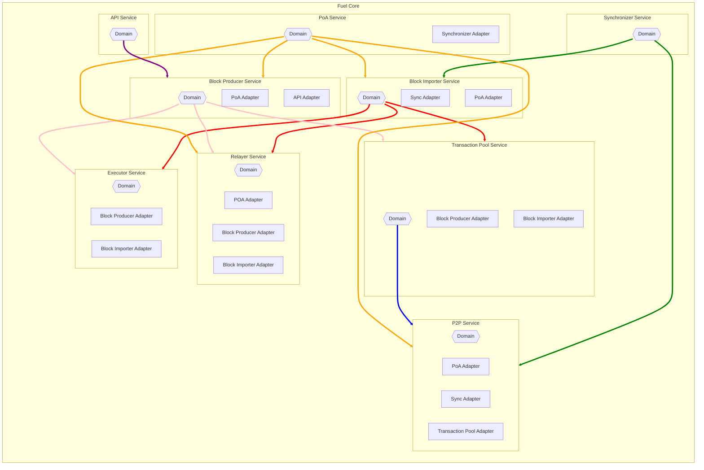

# Fuel Client Software Architecture

Inspired by [Hexagonal Architecture](https://en.wikipedia.org/wiki/Hexagonal_architecture_(software)), the Fuel 
blockchain client is composed of various domain modules. Each module defines its own view of the system 
via a class of traits we'll call "Ports". This is in contrast to creating globally shared interfaces
with the difficulty of trying to cover every possible use-case in a future-proof way, while on the other hand
leaking many irrelevant concerns across different domains. This approach may lead to a small amount of
monotonous and boring bloat in a few areas, but this is offset by the advantages of loose coupling.
This is intended to minimize the overall complexity and cognitive load of the codebase.
Business logic will have clear intentions and be easy to follow, unit tests don't need to mock low level details
about unrelated components, and refactors can easily control their blast radius.

In a system of shared global traits between modules, any updates to an interface will cause breaking changes
to the mocks and test harnesses for all consuming modules. This is less than ideal when these domain modules
don't need to use the new changes. However, in a system where each domain controls its ports, adjusting an
interface will only affect the port owner and the implementor.

The implementation of "Ports" (aka adapters) referring to other domain modules, should reside in the main fuel-core
crate. This way, domain modules should never need to take a dependency on each other. This helps to avoid circular
dependencies, and also allows for lightweight rapid developer iteration within a domain module. It also ensures
the purity of the domain modules, preventing implementation details of modules from contaminating each other. Adapters
are intended to restrict the viral spread of any ugly complexity that arises when integrating modules. Decisions
such as whether to use channels, networking, IPC, or direct calls between domain modules can be decided in the adapter
without any effect on the domain logic. They should avoid implementing any business rules, and only contain integration
glue logic between systems.

Special care was also taken in this design approach to keep implementation details regarding synchronization primitives
or proprietary async runtime requirements out of any public interfaces (No channels!).

Summary:

 - Business logic with many external dependencies should be segmented where possible into separate domain crates
 - Domain crates define "Ports" (traits) for external dependencies that aren't strictly of concern to the business logic.
 - Domain crates should aim to be as pure as possible and have minimal dependencies, and not depend on each other.
 - Adapters implement Ports. They are for integrating with the "real-world" dependencies like using other domain modules,
   implementing serialization logic, or calling a database.
 - Adapters should either reside in the top-level crate ("fuel-core") or in their own crates. This prevents the domains
   from being polluted by dependencies with large compile times or unstable interfaces. This allows for libraries like 
   networking, third-party SDKs, or database drivers to be swapped out without breaking our core domain specific logic.

The following is intended to be a living document to convey how P&A can and should be applied to the client. However, given
many of these components remain in flux as our needs change, these ports and flows should be considered as a foundation 
and structure for future design RFC refinements to build upon, rather than reflect a finalized view dictating how the 
system should forever be. When applying this design, it's encouraged to take practical and experimental steps to evolve our 
codebase using the Ports and Adapters (P&A) principles previously summarized to help guide our decision-making based on 
evidence discovered in the process of implementation and testing.

## Domains:



### (PoA) Consensus Module

#### Ports: fuel_poa_consensus::ports
```rust
trait BlockProducer {
    // used by the PoA node to produce a new block and obtain fully computed block headers
    async fn produce_block(height: BlockHeight) -> Result<FuelBlock>;
}

trait BlockImporter {
    // After the PoA node has signed over the block, send it to the block importer for inclusion
    // into the finalized state of the node.
    async fn commit(sealed_block: SealedBlock) -> Result<()>;
}

trait Relayer {
    // wait until the relayer eth node is synced
    async fn await_synced() -> Result<()>;
    // wait until the relayer reaches a desired da_height
    async fn await_da_height(da_height: DaHeight) -> Result<()>;
    // get the consensus key associated with a da_height
    async fn get_poa_key(da_height: DaHeight) -> Result<ConsensusKey>;
}

trait Database {
    // get the current fuel chain height
    fn get_current_height() -> Result<BlockHeight>;
    // insert consensus information associated with a sealed block that was locally produced
    fn insert_consensus_data(sealed_block: &SealedBlock) -> Result<()>;
}
```
#### Adapters: fuel_core::service::adapters::poa_consensus
```rust
impl fuel_core_sync::ports::Consensus for Service<PoA> {
    // insert impl here
}
```

### Block Producer

#### Ports: fuel_core_producer::ports

```rust
trait TransactionPool {
    fn select_block_txs(max_gas: u64, block_height: BlockHeight) -> Result<Vec<Arc<CheckedTransaction>>>;
    fn drop_txs(txs: Vec<TxId>) -> Result<()>;
}

trait Executor {
    async fn produce_block(block: &mut FuelBlock) -> Result<()>;
}

trait Relayer {
    fn get_finalized_da_height() -> Result<DaHeight>;
}
```
#### Adapters: fuel_core::service::adapters::block_producer
```rust
impl fuel_poa_consensus::ports::BlockProducer for Service<BlockProducer> {
    // insert impl here
}
```

### Block Importer

#### Ports: fuel_core_importer::ports

```rust
trait Relayer {
    // wait until the relayer is synced with ethereum
    async fn await_synced() -> Result<()>;
    // wait until a specific da_height is reached
    async fn await_da_height(da_height: DaHeight) -> Result<()>;
}

trait Executor {
    async fn validate_and_store_block(block: &FuelBlock) -> Result<()>;
}

trait TransactionPool {
    // remove a set of txs from the pool after a block is committed
    fn drop_txs(txs: Vec<TxId>) -> Result<()>;
}

trait Database {
    // insert consensus information associated with a sealed block
    fn insert_consensus_data(sealed_block: &SealedBlock) -> Result<()>;
}

trait PeerToPeer {
   // broadcast the finalized header to peers who may need to sync
   async fn broadcast_sealed_header(sealed_block_header: SealedBlockHeader) -> Result<()>;
}

```
#### Adapters: fuel_core::service::adapters::block_importer
```rust
impl fuel_poa_consensus::ports::BlockImporter for Service<BlockImporter> {
    // insert impl here
}

impl fuel_core_sync::ports::BlockImporter for Service<BlockImporter> {
    // insert impl here
}
```

### Synchronizer

#### Ports: fuel_core_sync::ports

```rust
trait PeerToPeer {
    type SealedHeaderResponse: NetworkData<SealedBlockHeader>;
    type BlockResponse: NetworkData<Vec<SealedBlock>>;
    type GossipedBlockHeader: NetworkData<SealedBlockHeader>;
    
    async fn fetch_best_network_block_header(&self) -> Result<Option<Self::SealedHeaderResponse>>;
    async fn fetch_blocks(&self, query: Range<BlockHeight>) -> Result<Self::BlockResponse>;
    // punish the sender for providing an invalid block header
    fn report_invalid_block_header(&self, invalid_header: &Self::SealedHeaderResponse) -> Result<()>;
    // punish the sender for providing a set of blocks that aren't valid
    fn report_invalid_blocks(&self, invalid_blocks: &Self::BlockResponse) -> Result<()>;
    // provides a stream of gossiped block header events
    fn gossiped_block_header_events(&self) -> BoxStream<Self::SealedBlockHeader>;
    // notify the p2p network whether to continue gossiping this message to others or
    // punish the peer that sent it
    fn notify_gossip_block_validity(&self, message: &Self::GossipedBlockHeader, validity: GossipValidity);
}

// Generic wrapper for data received from peers while abstracting
// networking metadata (e.g. IP's or other IDs) needed for gossip validation
pub trait NetworkData<D> {
    // Transfer ownership of the provided data without consuming other message metadata
    fn take_data(&mut self) -> Option<D>;
}

pub enum GossipValidity {
    // Report whether the gossiped message is valid and safe to rebroadcast
    Accept,
    // Ignore the received message and prevent further gossiping
    Ignore,
    // Punish the gossip sender for providing invalid 
    // (or malicious) data and prevent further gossiping
    Invalid,
}

trait BlockImporter {
    // commit a sealed block to the chain
    async fn commit(block: SealedBlock) -> Result<()>;
   
   // check with the block importer whether a block header passes consensus rules
   async fn validate_sealed_block_header(block: SealedBlockHeader) -> Result<()>;
}

trait Database {
    // get current fuel blockchain height
    fn get_current_height() -> Result<BlockHeight>;
}
```
#### Adapters: fuel_core::service::adapters::fuel_core_sync
_N/A_

### P2P

#### Ports: fuel_core_p2p::ports
```rust
trait Database {
    // used when other peers are syncing
    fn get_sealed_block(height: BlockHeight) -> Result<SealedBlock>; 
}
```

#### Adapters: fuel_core::service::adapters::peer_to_peer
```rust
impl fuel_poa_consensus::ports::PeerToPeer for Service<P2pService> {
    // insert impl here
}

impl fuel_core_sync::ports::PeerToPeer for Service<P2pService> {
    // insert impl here
}

impl fuel_core_txpool::ports::PeerToPeer for Service<P2pService> {
    // insert impl here
}
```

### Transaction Pool

#### Ports: fuel_core_txpool::ports
```rust
trait PeerToPeer {
    type GossipedTransaction: NetworkData<Transaction>;
   
    // Gossip broadcast a transaction inserted via API.
    async fn broadcast_transaction(transaction: Transaction) -> Result<()>;

    // Provides a stream of gossiped transactions.
    fn gossiped_transaction_events(&self) -> BoxStream<Self::GossipedTransaction>;
   
    // Report the validity of a transaction received from the network.
    fn notify_gossip_transaction_validity(message: &Self::GossipedTransaction, validity: GossipValidity) -> anyhow::Result<()>;
}

trait BlockImporter {
   // used to update the transaction pool from imported blocks
   fn committed_block_events(&self) -> BoxStream<SealedBlock>;
}

// Generic wrapper for data received from peers while abstracting
// networking metadata (e.g. IP's or other IDs) needed for gossip validation
pub trait NetworkData<D> {
   // Transfer ownership of the provided data without consuming other message metadata
   fn take_data(&mut self) -> Option<D>;
}

pub enum GossipValidity {
    // Report whether the gossiped message is valid and safe to rebroadcast
    Accept,
    // Ignore the received message and prevent further gossiping
    Ignore,
    // Punish the gossip sender for providing invalid 
    // (or malicious) data and prevent further gossiping
    Invalid,
}

pub trait Database:
    StorageInspect<Coins, Error = StorageError>
    + StorageInspect<ContractsRawCode, Error = StorageError>
    + StorageInspect<Messages, Error = StorageError>
    + Send
    + Sync
{}
```

#### Adapters: fuel_core::service::adapters::transaction_pool
```rust
impl block_importer::ports::TransactionPool for Service<TransactionPool> {
    // insert impl here
}

impl block_producer::ports::TransactionPool for Service<TransactionPool> {
    // insert impl here
}
```

#### Adapters: fuel_core::service::adapters::block_importer
```rust
impl transaction_pool::ports::BlockImporter for Service<BlockImporter> {
   // insert impl here
}

```

### Executor

#### Ports: fuel_core_executor::ports
```rust
trait Database: InterpreterStorage
  + StorageMut<Coins, Error = StorageError>
  + StorageMut<Messages, Error = StorageError>
  + StorageMut<Contracts, Error = StorageError>
  + StorageMut<Blocks, Error = StorageError>
  + StorageMut<ContractUtxos, Error = StorageError>
  + StorageMut<Transactions, Error = StorageError>
  + Send
  + Sync {
    // start a nested transaction to allow changes to be rolled-back
    fn db_transaction(&self) -> Box<dyn DatabaseTransaction>;
}

// Database overlay that accumulates changes until committed at the end.
trait DatabaseTransaction: AsRef<Box<dyn Database>> {
    // consume the transaction and commit the changes
    fn commit(self) -> Result<()>;
}
```
#### Adapters: fuel_core::service::adapters::executor
```rust
impl fuel_core_producer::ports::Executor for Service<Executor> {
    // insert impl here
}

impl fuel_core_importer::ports::Executor for Service<Executor> {
    // insert impl here
}
```

### Relayer

#### Ports: fuel_core_relayer::ports
```rust
trait Database: StorageMutate<Messages, Error = StorageError> {
    fn get_da_synced_height(&self) -> Result<DaBlockHeight>;
    fn set_da_synced_height(&self, height: DaBlockHeight) -> Result<()>;
}

trait DataAvailabilityLayer {
    async fn is_syncing(&self) -> SyncState;
    async fn best_finalized_block(&self) -> Result<DaBlockHeight>;
    async fn download_messages(&self, blocks: Range<DaBlockHeight>) -> Result<Vec<Message>>;
}

pub struct DaBlockHeight(u64);
```

#### Adapters: fuel_core::service::adapters::relayer
```rust
impl fuel_core_importer::ports::Relayer for Service<Relayer> {
    // insert impl here
}

impl fuel_core_producer::ports::Relayer for Service<Relayer> {
    // insert impl here
}

impl fuel_poa_consensus::ports::Relayer for Service<Relayer> {
    // insert impl here
}
```

### API (GraphQL)
Too extensive to fully detail...

#### Ports: fuel_core_api::ports

```rust
trait BlockProducer {
    // produce a single-tx block at a given height and return the receipts
    async fn dry_run_transaction(transaction: Transaction, height: Option<BlockHeight>) -> Result<Vec<Receipt>>;
    // start a debug session at a given height.
    async fn start_debug_session<S>(transaction: Transaction, height: Option<BlockHeight>) -> Result<Box<dyn DebugSession<S>>>;
}

trait DebugSession<S>: AsRef<Interpreter<S>> {
    fn memory(&self, start: usize, len: usize) -> Option<&[u8]>;
    fn register(&self, register: RegisterId) -> Option<Word>;
    fn reset(&mut self) -> Result<()>;
    fn execute(&mut self) -> Result<()>;
}
```

#### Adapters: fuel_core::service::adapters::api

```rust
impl fuel_core_api::ports::BlockProducer for Service<BlockProducer> {
    // insert impl here
}

impl<S> fuel_core_api::ports::DebugSession<S> for DebugSessionAdapter<S> {
    // insert impl here
}

// example of adapter fulfilled implementation
pub struct DebugSessionAdapter<S> {
    vm: Interpreter<S>,
    db: Database,
    tx: Transaction,
}
```

## Fuel Core Services

`fuel-core` is the connection point between all modules. Since adapters implement foreign traits for foreign domains,
each domain should be wrapped in a local new-type such as `Service<D>`. Services should be sharable via 
`Arc<Service<D: Stoppable + Send + Sync>>`.

The `Stoppable` trait ensures each service has a graceful shutdown method and join handle for any background tasks.
If a service does not spawn any background tasks, this trait can be implemented as a no-op.

## [Flows](./poa/flows.md)
