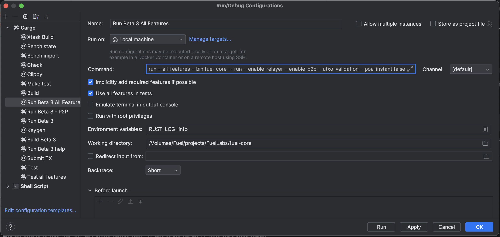

# Debugging

## Setup Requirements

Building Fuel is supported on macOS and Linux.

The Fuel client is written in Rust. For developers who wish to build the Fuel client locally, it is recommended to use the latest version of Rust. The build process uses the stable Rust toolchain.

See the [Fuel Client system requirements](../../README.md#system-requirements).

## Building and Running

Building and running debug builds of the Fuel client is done using Cargo.

By default, when using the `cargo build` or `cargo run` commands, Cargo generates a debug build. This build is optimized for debugging and development purposes, including debug symbols and minimal optimizations. IDEs rely on debug builds to provide robust debugging features.

The `cargo run` command will compile and execute the Fuel client application directly from source code. When running `cargo run`, Cargo compiles the Fuel client, and runs the resulting binary. During development and debugging, this should be used instead of installing the client (`cargo install`) or running the executable directly.

When building or running the Fuel client, it is recommended to pass the  `--all-features` flag to Cargo. This will instruct Cargo to compile the client with features such as P2P and the Relayer service.

To run the Fuel client, the following command can be used:

```bash
cargo run --all-features --bin fuel-core -- run <ARGUMENTS>
```

where `<ARGUMENTS>` is the desired set of arguments.

The list of arguments can be found by running the `help` command:

```bash
cargo run --bin fuel-core run --help
```

It is suggested to run the client with the P2P and Relayer services enabled. This is communicated to the CLI with the flags `--enable-p2p` and `--enable-relayer` respectively. Enabling these services requires that the client is compiled with the relevant features (`p2p` and `relayer`). These features are specified implicitly when the `--all-features` flag is specified.


## Environment

Users can supply CLI arguments to their node indirectly by populating the relevant environment variables. The list of CLI arguments and their environment variables can be found by running the `help` command.

Users can define environment variables by configuring their shell or setting them inside the current terminal.

Additionally, users can add a `.env` file to the root directory of their local copy of their Fuel node (or wherever the working directory is). Using a `.env` file requires compiling the client with the `env` feature. This can be accomplished by including `env` in the list of features or by passing the `--all-features` flag. 

Using environment variables for CLI arguments allows these values to be reused across IDEs and IDE configurations seamlessly.


## P2P Network

When running the client with the P2P service enabled, i.e., building the binary with the `p2p` feature and supplying the runtime argument `--enable-p2p`, the client will connect to a Fuel network. This requires additional CLI arguments, including the `--keypair` and `--network` arguments.

A key pair can be generated by running the utility binary `fuel-core-keygen`:

```bash
cargo run --bin fuel-core-keygen new
```

The resulting key pair printed to the console contains an address and secret. The `secret` can be provided to the `--keypair` argument when running the node.

The `--network` argument identifies the name of the network to join. The network name is used during peer discovery. For example, users can specify `--network beta-4` to join the Beta 4 network. Similarly, setting the environment variable `NETWORK="beta-4"` will produce the same result.

For more information about client networking, see the Fuel guide on [running a node](https://docs-hub.vercel.app/guides/running-a-node/).

## Common Issues

Developers running a local client may encounter potential issues with configuration or runtime execution. This section aims to provide examples of some of those issues and to provide known solutions.

**Address Already In Use**

```
Error: Address already in use (os error 48)
```

This error indicates there is already a local process running on the specified port. This can be another instance of the Fuel client or any other software running on the local system. 

In the case that the port is already occupied by another program running on the user's machine, the user can simply specify a new port using `--port <PORT>` (or supplying a `PORT` environment variable). If the port is occupied by another running instance of the Fuel client, users can kill the process. On macOS and Linux, this can be accomplished with the following steps:
1. In a new terminal, enter `lsof -i :PORT`, where `PORT` is replaced by the currently occupied port.
2. Find the process ID (PID) of the offending process and copy it.
3. Enter `kill -9 PID`, where `PID` is the process ID identified in the previous step.
4. The address is now available. Rerun the command to start the client. 

**RocksDB Error** 

```
Error: Failed to open rocksdb, you may need to wipe a pre-existing incompatible db `rm -rf ~/.fuel/db`
```

This error can happen under the following circumstances:
- Two (or more) local processes are running and attempting to access the same RocksDB instance
- The RocksDB instance was created from an older version of the client codebase and is incompatible with the client

In the case where multiple processes are attempting to access the RocksDB instance, the issue can be resolved by terminating any ongoing processes that are currently accessing the database. 

If there are no additional client processes running, the error is symptomatic of the latter case, and users can remove the incompatible database by performing the aforementioned command `rm -rf ~/.fuel/db` (specifying the exact path to the Fuel database as necessary).

**Panics**

```
thread 'main' panicked at 'source slice length (64) does not match destination slice length (32)', <>/.cargo/registry/src/index.crates.io-6f17d22bba15001f/fuel-types-0.36.0/src/array_types.rs:389:16
```

There are some circumstances under which the client may encounter a fatal or unexpected state, and execution panics. A common reason may be that the database schema was created from an older version of the client codebase. This can happen when switching between codebase versions (e.g., `git checkout ..`) with different database schemas. In this case, users can remove the database using `rm -rf ~/.fuel/db` (specifying the exact path to the Fuel database as necessary) and try again. If users continue to experience database errors due to RocksDB, they can opt to use an in-memory database instead by passing `--db-type in-memory`.

## Recommended IDEs

During development, it is recommended to delegate the execution of Cargo instructions to an IDE and connect the application to the IDE's debugger, instead of running these instructions manually.

Recommended IDEs include:
- CLion
- Visual Studio Code

## CLion

### Prerequisites

Running Fuel Core with CLion requires the official JetBrains Rust plugin. Find the Rust plugin by navigating to CLion's Plugin menu, entering "Rust" in the search. Install it by clicking "Install".

### Create A Run Configuration

1. In the top-right corner of the CLion window, click on the configurations dropdown menu and select "Edit Configurations..."
2. In the "Run/Debug Configurations" window, click on the "+" button and select "Cargo"
3. In the "Name" field, give your configuration a descriptive name, such as "Run Fuel Client"
4. In the "Command" field, enter `run --all-features --bin fuel-core -- run <ARGUMENTS>`, where `<ARGUMENTS>` represents the desired CLI arguments. Refer to the CLI documentation for guidance on which options and arguments to use.
5. If you use environment variables for configuration (as indicated in the CLI documentation), you can set them in the "Environment variables" section. Enter the variables and their values as needed. It is recommended to set the `RUST_LOG` environment variable to either `info` or `debug`.
6. By default, the "Working directory" field will be populated with the path to the root of your local repository. If this value has changed or is missing, enter the path to the root of your local repository here.
7. Click "Apply" or "OK" to save your run configuration.

#### Optional Settings

The "Before launch" settings are optional. CLion adds "Build" to these options by default, but this can be removed or configured to create a customized build flow. It is useful to remember that when using `cargo run`, Cargo automatically performs a build before execution. By having CLion perform the build prior to `cargo run`, CLion will invoke the same build process in a CLion run window. When CLion then invokes `cargo run`, Cargo will find that the binary is already built, and proceed immediately to execution.

### Example Configuration



### Running and Debugging

1. With your configuration selected in the dropdown menu, click on the Run button to start running your Fuel client node.
2. Alternatively, click on the Debug button to start your client node in debug mode.
3. Set breakpoints in the code where inspections are necessary. CLion will halt execution at these breakpoints, allowing variable inspection and step-by-step code execution.

## Visual Studio Code

### Prerequisites

Running Fuel Core with Visual Studio Code requires the CodeLLDB extension. Find the CodeLLDB extension by navigating to the "Extensions" tab and searching "CodeLLDB". Install it by clicking "Install".

### Create A Run Configuration

1. In VS Code, click on the "Run and Debug" icon in the left sidebar.
2. VS Code will offer to create a `launch.json` file to configure how your client node is run. Clicking this will prompt you to select a debugger. Select the CodeLLDB debugger to proceed. VS Code will generate a `launch.json` file for you.
3. In the "Run and Debug" menu, click the dropdown menu and select "Add Configuration..."
4. In the `"type"` field, enter `"lldb"`. In the `"request"` field, enter `"launch"`.
5. In the `"name"` field, give your configuration a descriptive name, such as `"Run Fuel Client"`
6. In the `"args"` array nested under `"cargo"`, enter the following arguments: `"build"`, `"--all-features"`, `"--bin=fuel-core"`.
7. In the top-level `"args"` array, enter the following arguments: `"run"`, `"--enable-p2p"`, `"--enable-relayer`, followed by any additional CLI values and arguments encapsulated by quotes. Refer to the CLI documentation for guidance on which options and arguments to use.
7. Save these changes made to your `launch.json` file.

### Example Configuration

Inside `launch.json`:

```json
{
    "version": "0.2.0",
    "configurations": [
        {
            "type": "lldb",
            "request": "launch",
            "name": "Run Fuel Client",
            "cargo": {
                "args": [
                    "build",
                    "--all-features",
                    "--bin=fuel-core"
                ]
            },
            "args": [
                "run",
                "--enable-p2p",
                "--enable-relayer",
                "--utxo-validation",
                "--poa-instant", "false"
            ]
        }
    ]
}
```

Users can prepend this example configuration to any existing list of configurations in their respective `launch.json` file. 

### Running and Debugging

1. Navigate to the "Run and Debug" tab. With your configuration selected in the configuration dropdown menu, click on the Run button to start running your Fuel client node.
2. Set breakpoints in the code where inspections are necessary. VS Code will halt execution at these breakpoints, allowing variable inspection and step-by-step code execution.

## Alternative Configurations

Developers can create additional configurations with alternative CLI arguments to experiment with different setups or debug specific features. For example, omitting the `--enable-p2p` flag (and related P2P arguments) will start the node without the P2P service. Similarly, omitting the `--enable-relayer` (and related relayer arguments) will start the node without the relayer service. Developers can create additional configurations to save specific combinations of CLI arguments and to conveniently switch between them.

Developers can also configure builds by selecting the desired compile-time features. For example, developers can omit the `p2p` service from compilation by explicitly passing a custom feature set to Cargo:

```bash
cargo run --features "relayer" --bin fuel-core -- run --enable-relayer <ARGUMENTS>
```


