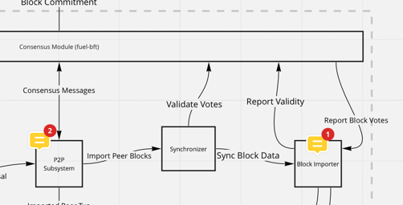

# The `fuel-sync` design the version for PoA

## Changelog

- TODO: Date of PR creation/approval

## Glossary

- FS - Fuel sync -> `fuel-sync`
- P2P - Fuel p2p -> `fuel-p2p`
- BI - Fuel block importer -> `fuel-block-importer`
- FC - Fuel core -> `fuel-core`
- CM - Consensus module
- Sealed data - The data(blocks, transactions, headers, etc.) signed by the block producer(PoA) or by the consensus comity(PoS)
- ABGT - Average block generation time in seconds
- TP - Transactions pool -> `fuel-txpool`

## Overview

The file describes the possible workflow of the FS service 
and its relationship with P2P and BI.
During the review process, team must select which way to go, and the document's 
final version will contain only the selected way with a proper overview.

The first final version of the document will describe the implementation 
of the FS for the PoA version of the FC. It may contain our assumptions 
and ideas for the next evolution of the FS for PoS(or maybe FS will 
have several evolution points).

All names are not final and can be suggested by the reviewers=)

## Relationship with P2P and BI



The FS is a connection point between:
- In the PoA version P2P and BI
- In the PoS is also additionally connects P2P with CM

There are three possible ways how to implement those relationships:

1. Every service knows about other services related somehow to it. It 
can be interpreted as: each service struct containing reference to other 
services inside and using the sync/async mechanism to interact.
1. Every service knows nothing about other services. It can be interpreted 
as: each service struct using channels for communication and knowing 
nothing about subscribers/listeners.
1. Every service **may** know about descending services but nothing about 
ascending services. As an example: P2P service knows nothing about its 
listeners(ascending services), and it only propagates information via 
channels. But FS knows about P2P(an example of descending service)
and may request some information directly by calling the sync/async methods. 
The same applies to BI. FS notifies all subscribers that it synced a valid block(sealed or not sealed).

Those rules are rough, and services can have cases where some functionality 
requires direct access and some pub-sub model. So it should be decided 
individually. But after comparison, the third rule covers all our needs 
for now, and the description below will use this rule. We can stop 
following this rule if it makes development harder, adds some complexity, 
or forces us to write ugly code with workarounds.

### P2P service requirements

The P2P service should not be aware of FS but still should provide some 
functionality that the FS can use. As a solution, P2P can implement the 
`BlocksFetcher` trait.

```rust
pub enum BlockBroadcast {
    NewSealedHeaders([Sealed<FuelBlockHeader>]),
    NewUnsealedHeaders([FuelBlockHeader]),
    NewSealedBlocks([Sealed<FuelBlock>]),
    NewUnsealedBlocks([FuelBlock]),
    // TODO: Some PoS related events
}

pub enum BlockReason {
    InvalidHeader,
    InvalidBody,
    // TODO: ?
}

pub enum Verdict<Reason> {
    Positive,
    Negative(Reason),
}

pub enum FetchRequest {
    HeadersByRanges([Range<BlockHeight>]),
    HeadersByHash([Bytes32]),
    BlocksByRanges([Range<BlockHeight>]),
    BlocksByHash([Bytes32]),
    /// Ask neighbors about the latest block height
    Heartbeat,
}

// TODO: `D` should implement some bound that allows to serialize it for gossiping.
pub trait Gossiper<D> {
    /// Gossips some `data` to the network.
    fn gossip(&self, data: &D);
}

pub trait Punisher<Reason> {
    /// Anyone can report the validity or invalidity of the data. The `Punisher` decide how to process it.
    ///
    /// Example: If the transaction or blocker header is invalid, the punisher can decrease the reputation 
    /// of the data provider.
    // TODO: `D` should implement some bound that allows retrieving the data's signer and allowing to broadcast it.
    fn report<D>(&mut self, data: D, verdict: Verdict<Reason>);
}

pub trait BlocksFetcher: Punisher<BlockReason> + Gossiper {
    /// Returns structure that can be used to subscribe for `BlockBroadcast`.
    fn sender(&self) -> &Sender<BlockBroadcast>;

    /// Fetches the data(somehow, maybe in parallel) and broadcasts ready parts.
    fn fetch(&mut self, request: FetchRequest);
}
```

The FS stores the reference(or a wrapper structure around P2P to allow `mut` 
methods) to the P2P and interacts with it periodically. 
All data is received from the channel and processed by FS to update the 
inner state of the synchronization. FS requests data from P2P for synchronization each time when it is required. 
If some data is invalid or corrupted, the FS reports 
it to P2P, and P2P can punish the sender of the data by decreasing the 
reputation(or blacklisting). FS calls `Gossiper::gossip` at the end of block synchronization.

The same approach can be used between the P2P and TP. 
`Punisher` trait adds a mechanism for [reputation management](https://github.com/FuelLabs/fuel-core/issues/460).
`Gossiper` trait solves [gossiping of invalid transactions](https://github.com/FuelLabs/fuel-core/issues/595).


### BI requirements

The FS is ascending service for the BI because BI knows nothing about 
other services; it only executes blocks and updates the state of the 
blockchain. At the end of the block commit, it notifies subscribers.

```rust
pub enum CommitBroadcast {
    Blocks([FuelBlock]),
}

pub trait BlocksCommitter {
    /// Returns structure that can be used to subscribe for `CommitBroadcast`.
    fn sender(&self) -> &Sender<CommitBroadcast>;

    /// Commits the blocks to the database. Executes each block from 
    /// `blocks`, validates it, and updates the state.
    /// 
    /// Return errors if something is wrong during the commit process.
    /// The state is not updated in that case.
    fn commit(&mut self, blocks: [Sealed<FuelBlock>]) -> Result<(), CommitError>;

    /// Returns the last committed block header.
    fn last_block_header(&self) -> FuelBlockHeader;
}
```

FS needs to subscribe to committed blocks because blocks can be generated 
by the block production service(or consensus). The FS can use the result 
of the `commit` function to update the inner state of the synchronization 
in case of an error. Also, `sender` method is helpful for a TP 
to prune committed transactions.

### Remark

The actual implementation may have different types but with the same 
meaning. If the P2P and BI provide described functionality, it is enough 
to implement FS and connect services fully.

## The blocks synchronization flow

FS has two types of synchronization:
- During PoS consensus. It includes validation of blocks, transactions, 
and signatures. A partially sealed(not all participants of consensus 
signed it) block may be the starting point of the synchronization.
- During sync with the network. The start point is a sealed block or 
block header.

The section contains the description of the flow for the second type. 

### The block propagation in the network

We have three ways of gossiping(about new block) implementation:

1. Gossip the height and block hash of a new block.
1. Gossip the header of a new block with the producer's seal(or consensus seal).
1. Gossip the entire block.

The first and second approaches require an additional request/response 
round to get the block. But the network passive resource consumption is 
low. With the first approach, malicious peers can report unreal heights, 
and FS needs to handle those cases in the code. With the second case, FS 
can verify the block's validity and start the synchronization process 
only in the case of validity.

The third approach provides the entire block, and it can be a faster 
way to keep the network updated. But it will spam the web with oversized 
useless packages(if each node has ten connections, then nine of the 
received packages are useless).

We already need to support syncing with requests/responses in the 
code for outdated nodes. So, using the third approach doesn't win much 
regarding the codebase size.

The second approach is our choice. When FS receives the sealed block header, 
it can already be sure this is not a fake sync process. The passive load for 
the network is low.

But it is not problem to try to sync to not valid height. P2P will 
request blocks for that height from the peer who reported it, and it will 
decrease the reputation. So we can use an approach with heights too. It requires
proper handling of this case.

#### Node behaviour

All nodes have the same FS, so it is enough to describe the work of FS.

##### Gossip about new data

Each node gossips only information that is validated by itself and can be 
proved by itself. It means the node gossips the block header only after 
committing the block.

The final destination of all blocks is BI. FS subscribes to events from 
the BI service and gossips the information about the latest block to 
the network on each commit via the `Gossiper` trait implemented by P2P.

It gossips the blocks received from the network, from the block producer, and from the consensus.

##### Ask about new data

The network gossips a new block by default with an `ABGT` interval with 
the [rule above](#gossip-about-new-data). But it is possible to have cases where 
someone forgot to notify another node.

FS has an internal timer that pings the P2P every `ABGT + Const`
(for example, `Const = 5` seconds). This timer resets on each block 
commit or timer tick. P2P, on each ping, asks neighbors about the latest block header.

### The blocks synchronization on block header event

FS has two synchronization phases, one is active, and another is pending. 
Each phase has its range of blocks to sync. They don't overlap and are 
linked. The purpose of the pending phase is to collect and join new 
block headers while the active phase syncs the previous range. When 
the first phase finishes synchronization, it takes some range from the 
pending phase, joins with the remaining range from the active phase, 
and requests blocks for the final range.

Because each block header is sealed, and FS knows the block producer 
of each block, it allows us to verify the validity of the header 
and be sure that the block range is actual without fake heights.

#### Fork

If FS gets the valid sealed block header but already have another block for this height, it is a case of the fork.
- For the PoA version: We ignore it and try to find blocks that link with our version of the blockchain. We should report it to the node manager(via logs, or maybe we want to do something more).
- For the PoS version: We should have rules in the consensus for this case.

#### Queuing of the block header

When FS receives a block header, first FS checks:
- Is it a valid header? It should be signed by the expected, for the node, producer/consensus at according height.
  - No -> `Punisher::report`.
  - Yes -> Next step.
  - Don't know. The Ethereum part is not synced yet to this height. If the height is 
  not far from the local ethereum height(the height returned by the 
  ethereum node), we ignore this header and do not punish the sender.
- Is it a new height?
  - No -> Is it already in the blockchain?
    - Yes -> Ignore(Maybe report some neutral error to P2P to prevent DDoS)
    - No -> It is case of the [fork](#fork).
  - Yes -> Next step.
- Is synchronization in progress?
  - No -> Create an active phase and init it. Start synchronization process.
  - Yes -> Next step.
- Is this height already handled by the active phase?
  - Yes -> If the header is the same?
    - Yes -> Ignore
    - No -> It is case of the [fork](#fork).
    - Don't know because it is in the middle of the range ->
      FS inserts this header into mapping and will check it later, 
      when blocks will come.
  - No -> Insert the header into range of the pending phase.

Each valid modification of the active or pending phase triggers requesting 
blocks for the active phase from P2P. P2P is responsible for managing how 
to process those requests. P2P decides which peers to ask, manages timeouts, 
and manages duplicate requests from other services.

P2P is also responsible for punishing nodes that send not requested information. 
Other nodes can only share information about their last block header(But it also 
should be limited because each node applies the block only once).

The P2P's responsibility can be part of the synchronizer instead, and it can store 
the information about the height of the peers and has an internal 
reputation who ask about blocks. It will make FS contain the full 
logic about synchronization but will duplicate reputation.

#### The active phase

Active phase has a range of currently syncing blocks. Each time FS 
receives a block header, it stores this header in a separate mapping. 
It is optional for FS because it only helps find forks. When FS receives 
the block for corresponding height, it compares headers.

If the range is extensive, FS splits it into batches, and only the first batch is
a part of the active phase, the remaining range is part of the pending phase.
FS requests only one batch simultaneously from P2P. It is possible to 
request several batches in parallel in the future.

When blocks come, it checks that they are valid and linked. 
If all checks pass, FS forward the blocks to BI and starts 
[commit process](#the-commit-of-the-blocks). If blocks are not valid, FS reports 
invalidity to P2P and requests block range again.

### The commit of the blocks

When FS receives blocks linked to the current latest block of the 
blockchain, FS starts to commit them(`BlockCommiter::commit`). Only one 
commit can be run in the BI at the exact moment, so BI has local mutex 
only for `commit` to prevent multiple commits.

`BlockCommiter::commit` return the result of execution:
- In the case of successful execution. FS waits for the event from the 
channel to remove committed blocks from the active phase, and join a new range from
pending phase.
- It can be an error that those blocks already are committed. It is a 
good case because another job has already committed blocks. Do the same 
as in the case of successful execution.
- It can be an error that BI got some error during execution. It is a
bad case, and it means that FS got a valid block signed by the producer, 
but FS can't apply it to the blockchain. Report it to logs and notify the node owner.

#### On block commit event

FS gossips about the node's latest via `Gossiper::gossip`.

FS removes committed blocks from the range of active phase. After FS 
fulfills it with a new range from the pending phase. The new range should 
always be <= the batch size. FS requests a new fulfilled range from P2P.