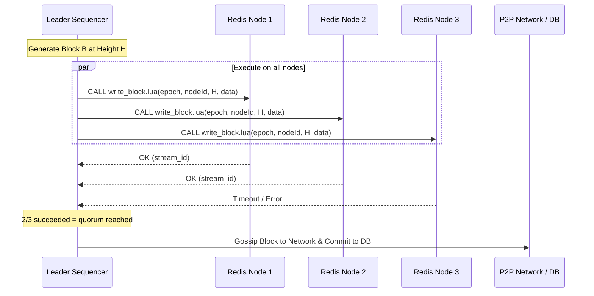
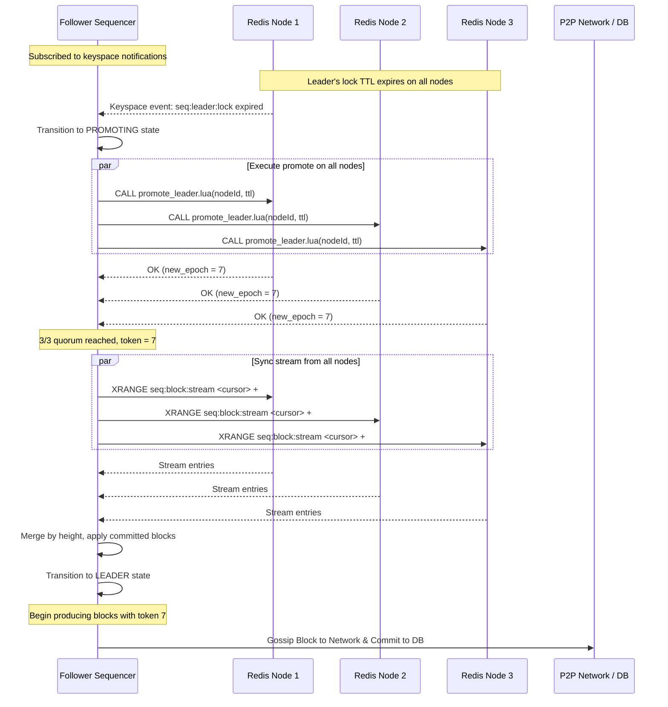
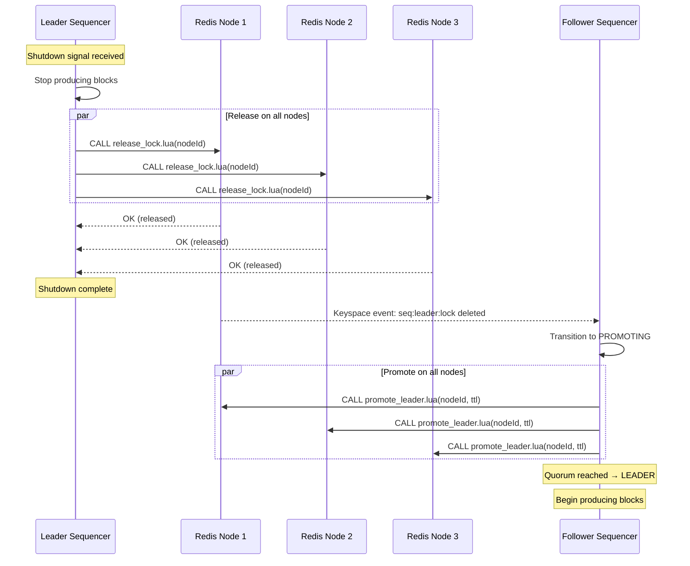

# Technical Design: High Availability Sequencer with Redis Fencing

## 1. Executive Summary

Currently, the Fuel Network sequencer operates as a single point of failure (SPOF). This document outlines a "Strong Leader" architecture using Redis as a coordination and fencing layer.

**What's implemented today:** A Redlock-based distributed leader lease system (`RedisLeaderLeaseAdapter`) that uses a quorum of Redis nodes to elect a single block producer. The leader acquires a distributed mutex, renews it before each block production, and releases it on graceful shutdown. This provides basic leader exclusivity and prevents split-brain.

**What this document proposes:** An enhanced architecture layering Fencing Tokens and Replayable Streams on top of the existing Redlock primitives. By adding a monotonic epoch counter and a Redis Stream as the source of truth for block history, we ensure that even during network partitions or process "gray failures," the network cannot fork and a secondary sequencer can safely take over without losing state.

## 2. Theoretical Foundation

### 2.1 The Split-Brain Problem

In distributed systems, a "Zombie Leader" (a node that believes it is still the leader but has been replaced) can cause catastrophic forks. Consider: Leader A's lock expires due to a long GC pause, Leader B acquires the lock and begins producing blocks, then Leader A resumes and also produces blocks at the same height. Without additional safeguards, both leaders believe they are authoritative.

### 2.2 Fencing Tokens

To solve this, we use a Fencing Token:

- Every time a new leader is elected, a global Epoch Counter (token) is incremented.
- Every "write" to the Source of Truth must include this token.
- The Source of Truth (Redis) rejects any write with a token lower than the current active one.

This provides a logical ordering guarantee that is independent of wall-clock time, making the system safe even under clock skew.

### 2.3 Redlock Algorithm (Implemented)

The codebase implements a Redlock-inspired distributed mutex for leader election. The algorithm works as follows:

1. **Acquire**: The candidate attempts to set a key on N Redis nodes using `SET key value PX ttl NX` (set-if-not-exists with millisecond expiry). If a quorum of `ceil(N/2) + 1` nodes grant the lock and the elapsed time is less than the lock validity period, acquisition succeeds.

2. **Renew**: The leader extends its lease by running a conditional `PEXPIRE` on each node — only if the stored value still matches the leader's token (a UUID generated per adapter instance).

3. **Release**: On shutdown, the leader conditionally deletes the key on all nodes — again, only if the stored value matches.

4. **Validity calculation**: After acquiring, the remaining validity is `TTL - elapsed_time - drift`, where `drift = TTL/100 + 2ms`. The lock is only considered held if remaining validity is positive.

Key configuration parameters:

| Parameter             | Default   | Purpose                                    |
|-----------------------|-----------|--------------------------------------------|
| `lease_ttl`           | 2s        | Lock expiry time                           |
| `node_timeout`        | 100ms     | Per-node operation timeout                 |
| `retry_delay`         | 200ms     | Base delay between acquire retries         |
| `max_retry_delay_offset` | 100ms  | Random jitter added to retry delay         |
| `max_attempts`        | 3         | Max acquire attempts per production cycle  |

### 2.4 Quorum Model for All Operations

The Redlock pattern — run a script on all N independent nodes in parallel, require quorum success — extends naturally beyond lock acquire/renew/release to cover **all** coordination operations, including fencing token management and stream writes.

Each Redis node independently stores its own copy of the lock, epoch token, and block stream. Every Lua script (`write_block.lua`, `promote_leader.lua`) runs on each node as an atomic, self-contained unit against that node's local keys. The quorum across nodes provides the distributed safety guarantee.

**Why this works — the pigeonhole argument:** Any two quorums of size `ceil(N/2) + 1` out of N nodes must share at least one member. Therefore:

- If Leader A was elected by quorum Q_A, and Leader B was later elected by quorum Q_B, then Q_A and Q_B overlap on at least one node.
- That overlapping node has B's lock and epoch. If zombie Leader A attempts a `write_block.lua` call, it must achieve quorum. Any quorum it contacts will overlap with Q_B, and the overlapping node will reject A's write via the lock-owner check (`current_leader ~= ARGV[2]`).

**Two layers of safety (defense-in-depth):**

- **Lock-owner check** (`current_leader ~= ARGV[2]`) is the **primary** safety mechanism. It independently prevents zombie writes regardless of epoch state. On any node where the lock exists with a different owner's ID, or has expired (GET returns nil), the check rejects the write. Combined with the quorum requirement and pigeonhole overlap, this alone prevents split-brain.
- **Fencing token** (epoch) is **defense-in-depth**. It provides an additional independent check at write time and — more importantly — enables stream conflict resolution during follower sync. If two leaders write at the same block height due to a timing race during promotion, the `epoch` field in the stream entry disambiguates which block is canonical (higher epoch wins; see Section 3.4). The system would be safe with only the lock-owner check + quorum, but the fencing token adds an extra layer for edge cases.

**Epoch divergence and self-healing:** Since `INCR` is not idempotent, if `promote_leader.lua` succeeds on quorum but not all nodes, epoch values diverge on the nodes that incremented but weren't part of the winning quorum. Additionally, `promote_leader.lua` gates `INCR` behind `SET NX` — the epoch can only be incremented on a node when the lock is FREE there. Once a leader holds the lock, that node's epoch is frozen until the lock expires or is released. This means drift only accumulates during the "election storm" — the window between lock expiry and a successful promotion. The divergence is bounded by the number of failed promotion attempts during this window (typically 1-3 given retry jitter, but theoretically unbounded in a sustained quorum-failure scenario). This does not affect safety — the lock-owner check prevents stale writes independently of epoch state, and the leader selects `max(returned_values)` from its promotion quorum as its token, ensuring writes pass the epoch check on all nodes where it holds the lock. **Crucially, `write_block.lua` includes a healing step**: on any node where the leader's epoch (`max(returned_values)`) is greater than the node's local epoch, the script sets the node's epoch to the leader's value. This means epoch divergence from election storms is resolved on the leader's very first successful block write — all nodes in the write quorum converge to the same epoch value, and repeated successful writes keep them aligned.

**Stream divergence is handled by quorum reads:** If `write_block.lua` succeeds on quorum but not all nodes, different nodes have different stream contents. Followers handle this by reading from all reachable nodes, merging entries by block height, and requiring quorum presence to consider a block committed (see Section 3.4).

## 3. Architecture Components

### 3.1 Redis State Schema

All keys exist independently on each of the N Redlock nodes. There is no cross-node replication — consistency comes from the quorum model.

| Key                  | Type            | Scope     | Description                                                  |
|----------------------|-----------------|-----------|--------------------------------------------------------------|
| `seq:leader:lock`    | String (TTL)    | Per-node  | Holds the Node ID of the current leader.                     |
| `seq:epoch:token`    | Integer         | Per-node  | Fencing token. May diverge across nodes after partial promotions; healed by `write_block.lua` on first successful write. |
| `seq:block:stream`   | Stream (XADD)   | Per-node  | Block history. A block is committed when present on quorum nodes. |

### 3.2 Sequencer States

Sequencers operate in one of three states with well-defined transitions:

```
                    Lock expired / released
                 ┌──────────────────────────────┐
                 │                               │
                 ▼                               │
           ┌──────────┐    Lock free     ┌──────────┐
           │ FOLLOWER │────────────────►│ PROMOTING │
           └──────────┘                  └──────────┘
                 ▲                               │
                 │         Promotion failed       │
                 ├────────────────────────────────┘
                 │                               │
                 │    Lock acquired + epoch       │
                 │    incremented + stream synced  │
                 │                               ▼
                 │                         ┌──────────┐
                 └─────────────────────────│  LEADER  │
                    Lock lost / shutdown   └──────────┘
```

**FOLLOWER**: Monitors the leader lock. Subscribes to Redis keyspace notifications for instant lock-expiry detection, with polling as a fallback. Continuously syncs state from `seq:block:stream` to stay ready for immediate promotion.

**PROMOTING**: Transitional state. The follower has detected the lock is free and is attempting atomic promotion: acquire lock, increment epoch token, sync any remaining blocks from the stream. If any step fails, returns to FOLLOWER.

**LEADER**: Actively producing blocks, guarding every write with the fencing token, and renewing its lease atomically with each block production. Exits to FOLLOWER on lock loss, fencing error, or graceful shutdown.

### 3.3 Follower Monitoring Strategy

Followers use a layered approach to detect leader failure as quickly as possible:

1. **Primary: Redis Keyspace Notifications** — Subscribe to `__keyevent@0__:expired` events on the lock key for near-instant detection of lock expiry.
2. **Fallback: Jittered Polling** — Periodically check the lock key with randomized intervals to handle cases where notifications are missed (e.g., subscriber reconnection).
3. **Pre-warmed Connections** — Maintain hot Redis connections at all times to eliminate connection setup latency during promotion.
4. **State Pre-sync** — Continuously consume from `seq:block:stream` so local state is always current, enabling immediate block production after promotion.

### 3.4 Follower Stream Sync Strategy

Since each Redlock node maintains its own independent stream, followers must reconcile potentially divergent streams during sync. The algorithm uses quorum reads to distinguish committed blocks from orphaned partial writes:

1. **Read from all reachable nodes**: For each node, `XRANGE seq:block:stream <cursor> +` using per-node cursors for incremental reads.
2. **Merge by block height**: Group entries across nodes by the `height` field (not Redis stream ID, which differs per node).
3. **Quorum check**: A block at a given height is considered **committed** only if it appears on `>= ceil(N/2) + 1` nodes. Blocks on fewer nodes may be orphaned partial writes from a leader that failed to achieve quorum.
4. **Conflict resolution**: If entries at the same height differ across nodes (possible after a leader failed mid-quorum and a new leader produced a different block), take the entry with the highest `epoch` field — it was written by the most recently elected leader.
5. **Apply in order**: Apply committed blocks to the local DB in ascending height order, skipping heights already committed locally.

In the common case (no failures), all nodes have identical streams and this reduces to a simple read from any single node. The multi-node merge is only needed when gaps or conflicts are detected.

## 4. Sequence Diagrams

### 4.1 Leader Production Flow (The Hot Path)

This diagram illustrates how the Leader ensures its block is authorized and renews its lease atomically across the Redlock quorum.



If the leader's token is stale or it no longer holds the lock on a quorum of nodes, the script returns `FENCING_ERROR` on those nodes. Without quorum, the leader steps down to FOLLOWER.

### 4.2 Follower Takeover Flow

This diagram shows the full sequence from leader failure through follower promotion to first block produced. The promotion script runs on all N Redlock nodes with quorum semantics.



If the promotion script fails to reach quorum (e.g., another follower won the lock on a majority of nodes), the follower releases any locks it did acquire and returns to FOLLOWER state. The `INCR` on partial nodes cannot be rolled back but does not affect safety (see Section 2.4).

### 4.3 Graceful Leader Stepdown

When a leader shuts down voluntarily, it releases the lock on all Redlock nodes to enable near-instant takeover without waiting for TTL expiry.



## 5. Lua Scripts

> **Execution model:** All Lua scripts run on each Redlock node independently. Each script is atomic within its node (standard Redis Lua guarantee). An operation is considered **committed** when the script succeeds on a quorum of `ceil(N/2) + 1` nodes. If quorum is not reached, the operation fails and any partial state (e.g., locks acquired on individual nodes) is cleaned up.

### 5.1 Existing Redlock Scripts (Implemented)

These scripts are already in the codebase (`crates/fuel-core/src/service/adapters/consensus_module/poa.rs`) and provide the foundation for leader election.

**Acquire Lock:**

```lua
-- Atomically acquire the lease if free
-- KEYS[1]: lease key (e.g., poa:leader:lock)
-- ARGV[1]: lease owner token (UUID)
-- ARGV[2]: lease TTL in milliseconds
if redis.call('SET', KEYS[1], ARGV[1], 'PX', ARGV[2], 'NX') then
    return 1
else
    return 0
end
```

**Renew Lock:**

```lua
-- Extend lease TTL if we are still the owner
-- KEYS[1]: lease key
-- ARGV[1]: lease owner token
-- ARGV[2]: lease TTL in milliseconds
if redis.call('GET', KEYS[1]) == ARGV[1] then
    return redis.call('PEXPIRE', KEYS[1], ARGV[2])
else
    return 0
end
```

**Release Lock:**

```lua
-- File: release_lock.lua
-- Release lease if we are still the owner (used on graceful shutdown / stepdown)
-- KEYS[1]: lease key
-- ARGV[1]: lease owner token (UUID)
if redis.call('GET', KEYS[1]) == ARGV[1] then
    return redis.call('DEL', KEYS[1])
else
    return 0
end
```

This script also serves as the **graceful stepdown** mechanism (see Section 4.3). No epoch or fencing check is needed here — each sequencer instance generates a unique UUID, so the ownership check alone guarantees that only the current lock holder can release. The epoch is incremented by the *next* leader during promotion via `promote_leader.lua`, not during stepdown.

### 5.2 Atomic Fencing & Lease Renewal Script (Proposed)

This script combines fencing, block publication, lock maintenance, and **epoch self-healing**. It ensures that a leader only keeps its lock if it is successfully persisting blocks. The identity check is performed first (primary safety), followed by the fencing check (defense-in-depth). If the leader's epoch (the `max()` from its promotion quorum) is greater than a node's local epoch — which can happen after election storms leave some nodes with lower epoch values — the script heals the divergence by setting the node's epoch to the leader's value. This means all nodes in the write quorum converge on the first successful block write.

```lua
-- File: write_block.lua
-- KEYS[1]: seq:block:stream
-- KEYS[2]: seq:epoch:token
-- KEYS[3]: seq:leader:lock
-- ARGV[1]: my_epoch (the max() found during promotion)
-- ARGV[2]: my_node_id (UUID/String)
-- ARGV[3]: block_height
-- ARGV[4]: block_data
-- ARGV[5]: lease_ttl_ms

local current_token = tonumber(redis.call('GET', KEYS[2]) or "0")
local current_leader = redis.call('GET', KEYS[3])

-- 1. Identity Check: Do I still own this lock on this node?
-- If the lock expired or was taken by a new leader, current_leader will not match.
if current_leader ~= ARGV[2] then
    return redis.error_reply("FENCING_ERROR: Lock lost or held by another node")
end

-- 2. Fencing Check: Is this node's epoch higher than mine?
-- This handles the case where a NEWER leader has already incremented the epoch.
if tonumber(ARGV[1]) < current_token then
    return redis.error_reply("FENCING_ERROR: Token is stale")
end

-- 3. Healing Logic:
-- If my epoch is valid and >= current_token, I "pull" this node forward.
-- This resolves divergence from "Election Storms" during the very first write.
if tonumber(ARGV[1]) > current_token then
    redis.call('SET', KEYS[2], ARGV[1])
end

-- 4. Atomic Write to Stream
local stream_id = redis.call('XADD', KEYS[1], '*',
    'height', ARGV[3],
    'data', ARGV[4],
    'epoch', ARGV[1],
    'timestamp', redis.call('TIME')[1]
)

-- 5. Lease Renewal: Heartbeat through work
redis.call('PEXPIRE', KEYS[3], ARGV[5])

return stream_id
```

### 5.3 Follower Promotion Script (Proposed)

Atomic follower promotion: check lock is free, acquire lock, increment epoch, and return the new fencing token — all in a single Lua script to prevent races between competing followers.

```lua
-- File: promote_leader.lua
-- KEYS[1]: seq:leader:lock
-- KEYS[2]: seq:epoch:token
-- ARGV[1]: my_node_id
-- ARGV[2]: lease_ttl_ms
--
-- Returns: new epoch token on success, error if lock is held

-- 1. Try to acquire the lock (only if free)
local acquired = redis.call('SET', KEYS[1], ARGV[1], 'PX', ARGV[2], 'NX')
if not acquired then
    return redis.error_reply("LOCK_HELD: Another leader holds the lock")
end

-- 2. Increment the epoch token atomically
local new_token = redis.call('INCR', KEYS[2])

return new_token
```

**Token selection:** Each node may have a different epoch before `INCR`, so the returned values may differ across quorum nodes. The leader takes `max(returned_values)` from its quorum as its fencing token. Using the maximum guarantees the leader's token is `>=` all epochs on its quorum nodes, ensuring `write_block.lua` passes the epoch check on every node where the leader holds the lock.

### 5.4 Quorum Failure Handling

When a Lua script fails to achieve quorum, the caller must clean up partial state:

- **`promote_leader.lua` fails quorum**: The follower acquired the lock and incremented the epoch on some nodes but not enough. The follower releases the lock on nodes where it succeeded (using the existing `release_lock` script). The `INCR` on those nodes cannot be rolled back, leaving their epoch ahead of other nodes. Repeated failed promotions across different node subsets can compound this drift — the divergence is bounded by the number of failed attempts during the election storm window, not a fixed ±1. In practice this is 1-3 attempts given retry jitter, but could be larger under sustained quorum failures. This does not affect safety: the lock-owner check is the primary safety mechanism (see Section 2.4), and the winning leader always uses `max(returned_values)` as its token. **Crucially, this divergence is automatically healed**: the winning leader's first `write_block.lua` call sets the epoch on any lagging node to the leader's `max()` value (see Section 5.2, step 3), converging all quorum nodes on the very first block write.

- **`write_block.lua` fails quorum**: The block was written to the stream on some nodes but not enough to be considered committed. The leader should **not** gossip or commit this block locally. On those nodes, the stream contains an "orphaned" entry that will be ignored by followers during sync (the quorum-read algorithm in Section 3.4 requires quorum presence to consider a block committed). The new leader may produce a different block at the same height — the `epoch` field in the stream entry resolves this conflict (higher epoch wins).

### 5.5 Why There Is No Heartbeat Script

Block production runs at 1 block/sec (including empty blocks on idle networks). The `write_block.lua` script renews the lease on every successful block write, making block production itself the heartbeat.

A separate keepalive script is **deliberately omitted** because it would mask production failures. If the leader cannot produce blocks (KMS outage, execution engine failure, DB corruption), the lock **should** expire to trigger failover. The lock represents *production capability*, not just process liveness.

## 6. Minimizing Failover Time

The time between leader failure and a follower producing its first block has several components. Each can be optimized:

```
Leader fails    Lock expires    Follower         Lock acquired    First block
     │               │          detects              │            produced
     ▼               ▼            ▼                  ▼               ▼
     ├───────────────┤├───────────┤├─────────────────┤├──────────────┤
     │  TTL rundown  ││ Detection ││   Promotion     ││  Production  │
     │   (~2s)       ││  (<10ms)  ││   (~1-2ms)      ││  (~100ms)    │
     │               ││           ││                  ││              │
```

**Total estimated failover time: ~2.1s** (dominated by TTL expiry)

### 6.1 Redis Keyspace Notifications

Followers subscribe to `__keyevent@0__:expired` on the lock key to get instant notification when the TTL expires. This eliminates polling delay and reduces the detection phase to the Redis pub/sub delivery time (sub-millisecond on local network).

Configuration required on Redis:

```
CONFIG SET notify-keyspace-events Ex
```

### 6.2 TTL Tuning

With 1 block/sec production, the lock is renewed every second. The TTL controls how long after the last successful block the lock persists:

| TTL  | Time after last block | Failover time | Tolerance for transient delays |
|------|-----------------------|---------------|-------------------------------|
| 2s   | ~1s                   | ~1.1s         | Low — a single missed block triggers expiry |
| 3s   | ~2s                   | ~2.1s         | Moderate — tolerates 1 missed renewal |
| 5s   | ~4s                   | ~4.1s         | High — tolerates several missed renewals |

**Recommendation**: Start with a 3s TTL. This tolerates one missed block production cycle (e.g., a brief network hiccup to Redis) while keeping failover under 3 seconds. Adjust based on observed production reliability.

### 6.3 Pre-warmed Connections

Followers maintain persistent multiplexed Redis connections at all times. The existing implementation already caches connections per node via `redis_node.cached_connection`. This eliminates ~1-5ms of connection setup latency during the critical promotion path.

### 6.4 Staggered Follower Polling (Fallback)

While keyspace notifications are the primary detection mechanism, followers also poll the lock key at jittered intervals as a fallback. The jitter prevents thundering herd effects when multiple followers detect the same expiry:

- **Poll interval**: 500ms base
- **Jitter**: +0-200ms random offset per follower
- **Purpose**: Catch cases where a keyspace notification is missed (e.g., subscriber reconnecting after a brief network blip)

### 6.5 Leader Voluntary Stepdown

Already implemented in the codebase. On graceful shutdown, the leader explicitly releases the lock via the conditional `DEL` script (see Section 5.1). Combined with keyspace notifications, this enables near-instant takeover since followers don't need to wait for TTL expiry.

The existing `Drop` implementation provides a dual-path release:
1. Attempts async release via a spawned tokio task
2. Falls back to blocking release if the runtime is unavailable
3. Both paths have a 100ms timeout to avoid blocking shutdown

### 6.6 Follower State Pre-sync

Followers continuously consume from `seq:block:stream` on all Redlock nodes using the quorum-read algorithm (Section 3.4) and per-node cursors for incremental reads. When promotion occurs, the follower only needs to sync any blocks produced between its last read and the moment it acquires the lock — typically zero or one block. This eliminates what would otherwise be the most time-consuming part of failover.

## 7. Lease Management Strategy

### 7.1 "Heartbeat Through Work" Principle

The lease is **only** renewed when a block is successfully produced and written to the Redis stream. There is no separate keepalive mechanism. This design ensures that the lock represents the leader's ability to advance network state, not merely its process liveness.

Consequences:
- **KMS outage** (can't sign blocks) → lock expires → failover
- **Execution engine failure** → lock expires → failover
- **Redis partition** (can't write blocks) → lock expires → failover
- **Healthy leader, idle network** → produces empty blocks → lock renewed

### 7.2 Production-based Renewal Cadence

Block production targets 1 block/sec. Each `write_block.lua` call atomically appends to the stream and refreshes the lock TTL. With a 3s TTL, the leader has a 2-block grace period before expiry.

```
Time:   0s    1s    2s    3s    4s
        │     │     │     │     │
Block:  B1    B2    B3    B4    B5
TTL:    3s    3s    3s    3s    3s
        ▲     ▲     ▲     ▲     ▲
        └─ Each write resets TTL to 3s
```

If the leader fails at t=1.5s (after B2 but before B3):
- Lock expires at t=4.5s (last renewal at t=1s + 3s TTL)
- Follower detects at t=4.5s (via keyspace notification)
- Follower produces first block by ~t=4.6s
- **Total gap: ~3.1s** (2 missed blocks)

### 7.3 Connection Pooling and Timeout Strategy

The existing implementation uses multiplexed connections with the following strategy:

- **Connection caching**: One multiplexed connection per Redis node, lazily initialized
- **Operation timeout**: 100ms per node (configurable via `node_timeout`)
- **Failed connection handling**: Invalid connections are cleared from cache and re-established on next use
- **Parallel execution**: All quorum nodes are contacted concurrently via `futures::future::join_all()`

## 8. Failure Mode Analysis

| Failure | Result | Mitigation | Failover Time Impact |
|---------|--------|------------|---------------------|
| **Sequencer network partition** | Leader cut off from Redis. Cannot publish blocks or refresh lease. | Lock expires; follower promotes. Fencing token prevents zombie writes. | TTL duration (2-3s) |
| **Zombie leader write** | Dead leader resumes after long GC pause and attempts to write. | `write_block.lua` checks both epoch token and node_id on each node. Zombie cannot achieve quorum — any quorum overlaps with the new leader's promotion quorum (pigeonhole). | None (prevented) |
| **Redis node crash** | One of N Redlock nodes becomes unavailable. | Quorum model tolerates minority node failures. Remaining nodes continue to serve lock, epoch, and stream operations. | None — quorum still reachable |
| **Clock skew** | TTLs expire early or late across nodes. | Fencing token (epoch) provides logical safety independent of time. TTL is only for liveness. Drift factor (`TTL/100 + 2ms`) provides safety margin. | Minimal — bounded by drift factor |
| **KMS / signing outage** | Leader cannot sign blocks. | No separate heartbeat means lock naturally expires. Follower takes over and attempts signing with its own KMS. | TTL duration (2-3s) |
| **Multiple followers race to promote** | Two+ followers detect expiry simultaneously. | `promote_leader.lua` uses `SET NX` per node — only one can win quorum. Losers release partial locks and return to FOLLOWER. Epoch INCR on partial nodes is non-reversible but safe (Section 5.4). | None (atomic per node, quorum decides) |
| **Keyspace notification missed** | Follower doesn't receive expiry event (e.g., reconnecting). | Fallback jittered polling detects the free lock within 500-700ms. | +500ms worst case |
| **Redis quorum loss** | Fewer than `ceil(N/2)+1` nodes reachable. | Leader stops producing (cannot renew). When quorum restores, production resumes. No split-brain possible. | Quorum restoration time |
| **Partial block write (< quorum)** | Block written to some nodes but not committed. | New leader ignores orphaned entries (quorum-read in Section 3.4). May produce different block at same height with higher epoch. `epoch` field in stream entries resolves conflicts. | None (uncommitted block is invisible) |
| **Epoch divergence across nodes** | Node epochs drift apart after repeated failed promotions. Drift bounded by failed attempts during election storm, not a fixed ±1. | Lock-owner check is the primary safety mechanism and prevents stale writes independently of epoch state (Section 2.4). Leader uses `max(returned_values)` as its token. **Self-healing in `write_block.lua`** pulls lagging nodes forward to the leader's epoch on the very first block write, actively converging divergent epochs. | None (safety unaffected; divergence is transient) |
| **Node rejoins after partition** | Node has stale epoch and incomplete stream. | If the leader holds the lock on this node (lock was acquired during promotion but node was partitioned after), `write_block.lua` will heal its epoch forward and resume writing to its stream. If the leader does not hold the lock there, writes fail the lock-owner check on this node — not a safety issue, quorum holds on other nodes. Follower sync reads from all nodes and merges. | None — quorum still holds on other nodes; epoch healed on first successful write |

## 9. Performance Tradeoffs

- **Sync Latency**: Each block production requires a synchronous round-trip to all N Redis nodes (~1ms on local network, executed in parallel). Total latency is the maximum of individual node latencies, not the sum. The `write_block.lua` Lua script (up to 5 commands including conditional epoch healing vs 1 for simple acquire) adds microseconds of server-side execution — negligible compared to network RTT. The epoch healing `SET` only fires on the first write after promotion; subsequent writes skip it since the epoch already matches.
- **Block Data Payload**: `write_block.lua` sends block data to all N nodes. If blocks are large (e.g., 10KB+), consider storing a block hash/reference in the stream and the full block data via a separate mechanism (local DB, P2P) to reduce Redis network load.
- **Redis Reliability**: The system is dependent on Redis uptime. Mitigation: deploy at least 3 independent Redis nodes for a quorum of 2. Each node can itself be backed by Redis Sentinel for individual node HA.
- **Stream Cleanup**: Use `XTRIM` with `MAXLEN` to bound memory usage on each node. Only recent blocks need to remain in the stream — older blocks are committed to the sequencer's local DB and gossiped to the network. Trimming can be included in `write_block.lua` for atomicity: `redis.call('XTRIM', KEYS[1], 'MAXLEN', '~', 1000)`.
- **Quorum Overhead**: Each operation contacts all N Redis nodes in parallel. With 3-5 nodes, this adds negligible overhead but provides tolerance for minority node failures.

## 10. Conclusion

The architecture extends the Redlock quorum model from simple lock management to a complete coordination layer — locks, fencing tokens, and block streams all operate under the same quorum semantics across N independent Redis nodes.

Two levels of safety reinforce each other:

1. **Liveness (implemented)**: The Redlock-based distributed mutex ensures that at most one sequencer holds the leader lease at any time. Graceful shutdown releases the lock immediately; ungraceful failure relies on TTL expiry.

2. **Safety (proposed)**: Fencing tokens and the Redis stream provide a logical ordering guarantee. The combined epoch + lock-owner check in `write_block.lua`, enforced per-node with quorum across nodes, ensures that even during network partitions, GC pauses, or partial failures, no stale leader can corrupt the block stream. The pigeonhole property of quorums guarantees that any zombie write attempt will be rejected on at least one node in common with the new leader's quorum.

Epoch divergence across nodes (from partial promotions) and stream divergence (from partial writes) do not affect safety. Epoch divergence is actively healed: `write_block.lua` pulls lagging nodes forward to the leader's epoch on its first block write, making divergence transient rather than accumulating. The quorum-read sync algorithm enables followers to reconstruct a consistent view from potentially divergent per-node streams.

Integrating lease renewal into the block publication logic creates a "heartbeat through work" pattern. This ensures that the sequencer's authority is strictly tied to its ability to advance the state of the network, providing the highest level of safety against split-brain scenarios.
