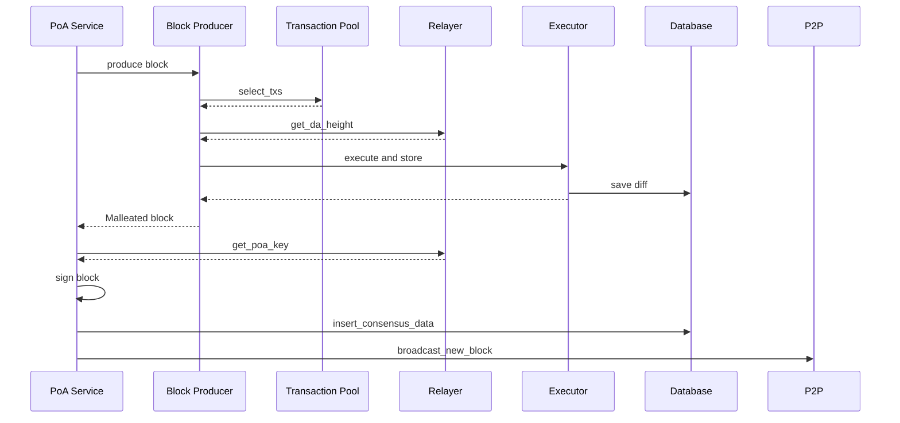
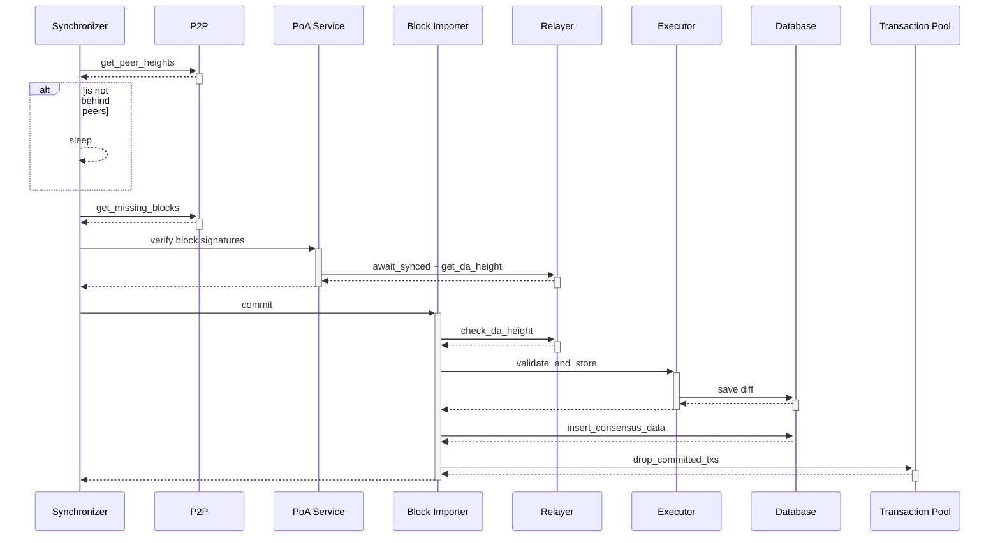
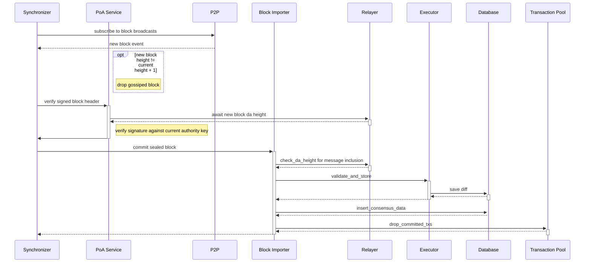

# Flows

## PoA Primary Production Flow
When the node is configured with a POA key, produce blocks and notify network.

## PoA Synchronization Flow

When a node is behind peers, download the block data and catch up.

## PoA Gossip-Sync Flow

When a non-producer is synced to the PoA node, the synchronizer can switch to using gossip to capture newly finalized blocks.

