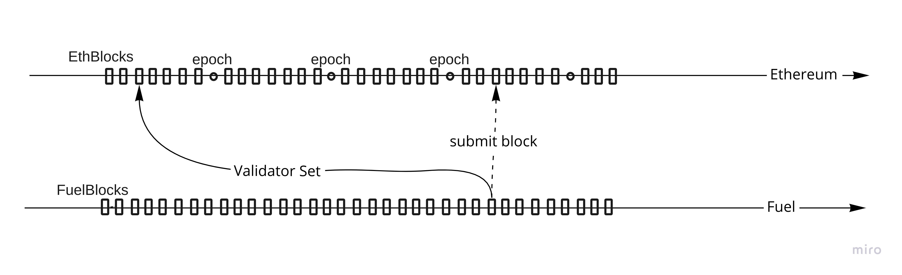

# Relayer

We will need to connect with ethereum node provider or client to have open API.

Functionalities expected from Relayer:

* Validator staking:
    * Deposit. Handle ValidatorList use it in consensus
    * Withdrawal. Handle ValidatorList use it in consensus.
* Bridge:
    * Deposit tokne
    * Withdwrap token
* Block related (mostly skipped for PoS version):
    * Publishing new block
    * Calculating new ValidatorSet.
    * Receiving block from contract (Not impl)
    * Validating received block (Not impl)
    * pushing challenge if needed (Not impl)

## Validity, finality and syncronization

With ethereums The Merge comming in few months we are gaining finality of blocks in ethereum after two epochs, epoch contains 32 slots, slot takes 12s so epoch is around 6,4min and two epocs are 12.8min, so after 13min we are sure that our deposits will not be reverted by some big reorganization. So we are okay to say that everything older then ~100blocks are finalized.

Second finality that we have is related to fuel block atestation timelimit, how long are we going to wait until challenge comes. It should be at least longer than ethereum finality. Not relavent for first version.

- Problem: Validator deposit to ethereum gets reverted by block reorg. (Eth clients usually have priority for reverted txs but this does not mean it cant happen). It can potentially rearange order of transactions
- Solution: Introduce sliding window, only deposits that are at least eth finality long can be included in validators leader selection. We will need to have pending events before they are merged and handle reorgs.

Example of sliding window:

- Problem: How to choose when token deposit event gets processed and enabled for use in fuel, at what exact fuel block does this happen? (Note that we have sliding window)
- Reasoning: We can't just say when fuel block N gets chained use deposits from Eth Block in past, those two events (fuel block and eth block) are not correlated.
- Reasoning: Inside one of eth block we can have block_commit and multiple deposits and order matters if we want to put deposit inside block_number N or block_number N+1. And from this we can have our solution
- Solution: Use eth logs(events) of block commit and token deposit to conclude where deposit belongs and use contract as main syncronization between eth and fuel. 

For last problem we need to introduce two slidding windows, one for how long do we wait for eth blocks to be finalized and second one is how far in past are we taking validator stake and deposits. Two are needed because there could be small desyncronization between eth and fuel and we need to introduce buffer just to be safe.

### Validator related stake:
Validator stake is deposited on Ethereum contract side,

- Problem: Validator before its eth finality passes, withdraws its stake. We have sliding windows that is in past but if we allow withdrawal immediately there will be no stake to take if slashing happens in present.
- Solution: Lock period. Withdrawal should be two step process, first step is WithdrawalIntention that will lock funds for Withdrawal and wait for eth finality time to kick in. After WithdrawalIntention gets eth finalize, stake is removed from Fuel Validation Leader selection. Fuel does not see this stake any more, on contract side we need to wait for fuel slider to finish and additional time for challange time to pass after than stake can be withdrawed.

### Bridge

Bridge has functionality to connect ethereum ERC-20 tokens with Fuel network and allow transfer of token between them. Deposit and withdrawal are lot simpler in comparising to staking.

Deposit transfers token into contract and after fuel slidder time and eth finalization passes it can be used inside Fuel network.

- Problem: How would we specify Deposit as Input to be used by Tx, if it is UtxoId we can use TxId (index_output as zero) but how would this integrate with database.
- Solution: TokenDeposit has deposit_nonce that we can leverage, introduce DepositInput is cleanest solution. Andwe can hybrid approch of introducing hardcoded UtxoId. 

For Withdrawal, any Tx can have OutputWithdrawal and that information is send inside a fuel block to eth contract and token is set for withdrawal.

- Problem: How long does finalization of fuel block takes. It probably depends on challenge timeframe. Only when block is finalized than we are safe to do withdrawal without thinking of slashing or reverting of fuel blocks.

## Implementation:

For fetching logs from contract use ethers-rs to fetch data and be consistent what exactly we are getting. We need to be sure that we are receiving/reading all logs from out contracts that we are watching. That means having index what we have read.

Propagating of block is simplest thing, whatever consensus give us FuelBlock transfer it into PackedFuelBlock, calculate expected gas_price/gas_limit, sign it, and send it to contract. Validation and challange comes later.

### Syncing flow

Tricky thing that can happen not so often is in initial synchronization. When do we start log subscription and when do we stop importing log from block. Initial sync is done as:
1. sync from HardCoddedContractCreatingBlock to (BestEthBlock-EthFinalitySlider)
2. sync overlap from LastIncludedEthBlock to BestEthBlock and save them in dequeue.
3. Start listening to eth events
4. Check if our LastIncludedEthBlock is same as BestEthBlock.
  If not the same, stop listening to events and do 2,3,4 steps again.
7. Continue to active listen on eth events. and prune(commit to db) dequeue for older finalized events

On active listening of eth events:
1. Receive event:
    1. if it is removal, append them into pending_removal vec
    2. if it is new event. Apply pending_removal_vec and add new event to dequeue.
2. On new fuel block, commit changed to db.
     1. just to be sure introduce check of events by calling eth block logs. This is a double check just to be sure
         that we match with that is inside contract.

To have validity of ValidatorSet we need to have logs from ethereum to reconstruct the set. So It does not matter for us if we start syncing to fuel network if we are not connected to eth client.

For passive sync we are using ethereum pubsub protocol to get `logs` event: https://geth.ethereum.org/docs/rpc/pubsub . Example of eth log from log subscription:
* "address":0xc02aaa39b223fe8d0a0e5c4f27ead9083c756cc2,
* "topics":[0x00,0x00,0x00],
* "data":"Bytes",
* "block_hash":Some(Hash)),
* "block_number":Some(14069822),
* "transaction_hash":Some(0xcf7baaa6e6cd2d863807a3b8d3168f8d2699ad043e3ac249e82887fda6c4ef55),
* "transaction_index":Some(130),
* "log_index":Some(172),
* "transaction_log_index":"None",
* "log_type":"None",
* "removed":"Some(false)"