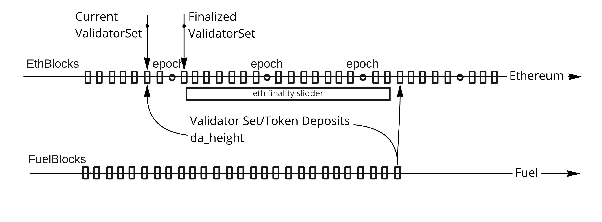

# Relayer

Functionalities expected from Relayer:

* Validator staking (Handle ValidatorList and use it for fuel-bft):
  * Validator registration and unregistration
  * Delegator delegations deposits and withdrawal
* Bridge:
  * Receive message
  * Transmit message
* Block related:
  * Publishing new block

## Validity, finality and synchronization

With Ethereum's The Merge coming in few months we are gaining finality of blocks in ethereum after two epochs, epoch contains 32 slots, slot takes 12s so epoch is around 6,4min and two epochs are 12.8min, so after 13min we are sure that our deposits will not be reverted by some big reorganization. So we are okay to say that everything older then ~100blocks are finalized.

Second finality that we have is related to fuel block attestation time limit, how long are we going to wait until challenge comes. It should be at least longer than ethereum finality. Not relevant for first version.

* Problem: Validator deposit to ethereum gets reverted by block reorg. (Eth clients usually have priority for reverted txs but this does not mean it cant happen). It can potentially rearrange order of transactions
* Solution: Introduce sliding window, only deposits that are at least eth finality long can be finalized and included in validators leader selection. We will need to have pending events before they are merged and handle reorgs.

Example of sliding window:

* Problem: How to choose when bridge message event gets enabled for use in fuel, at what exact fuel block does this happen? (Note that we have sliding window)
* Solution: introduce `da_height` variable inside fuel block header that will tell at what block we are including validator delegation/withdrawal and token deposits.

There are few rules that `da_height` (da as data availability) need to follow and can be enforced with v2 contract:

* Last block `da_height` needs to be smaller number then current one.
* `da_height` shouldn't be greater then `best_da_block`-`finalization_slider`

In most cases for fuel block `da_height` can be calculated as `current_da_height-1`

### Validator related stake

Validator stake is deposited on Ethereum contract side.

When deposit happens and finality period passes, stakes are included in validator set.

* Problem: Validator before its eth finality passes, withdraws its stake. We have sliding windows that is in past but if we allow withdrawal immediately there will be no stake to take if slashing happens in present.
* Solution: Lock period. Withdrawal should be two step process, first step is WithdrawalIntention that will lock funds for Withdrawal and wait for eth finality time to kick in. After WithdrawalIntention gets eth finalize, stake is removed from Fuel Validation Leader selection. Fuel does not see this stake any more, on contract side we need to wait for fuel slider to finish and additional time for challenge time to pass after than stake can be withdrawn.

Delegation: ...

### Bridge

Bridging is currently WIP and it is moving as generalizes messages between smart contract gateway.

## Implementation

Info about fuel-relayer structure:

* `Service`: a way to initialize relayer
  * `Relayer`: the main mod that contains initial sync and handling of inbound channels from both ethereum and fuel:
    * `FinalizationQueue`: before events get finalized they are saved in memory here, we handle the finalization of events here.
      * `PendingBlocks`: Handles what block are committed to the contract and what is the best block inside fuel network. This is the place where we do packing of eth transaction and bundling of block commits.
      * `Validators`:  Has a last finalized validator set. Handles saving of diffs to database and applying that diff current validator set.

`Log` mod contains type casting from eth log to event that we can digest. `bin/testrun.rs` is simple run with DummyDb for manual testing.

Communication channels that we have:

* Inbound `fuel_block_importer` with `NewBlockEvent`: new block event from fuel, , mostly send block commit if this client created new fuel block
* Inbound `requests` with `RelayerRequest`: request for relayer for example for validator set.
* `da_block_watcher`: do finalization on this event
* `logs_watcher`: insert logs into finalization_queue.

On the database side we have:

* `StakingDIffs` table: for every da_block it contain staking diff. Staking diff contains un/registration of validator and delegations
* `ValidatorSet` table: validator set at last finalized da block.
* `DelegatesIndex` table: One delegation has a list of validators and delegation stakes, when undelegating or adding a new delegation, the old delegation needs to be removed. This index contains list of blocks where delegation happened so that we can traverse it and get that old delegation.
* `DaMessage`: table of finalized bridge messages.

And some DB variables:

* `validator_da_height`: Relater to `ValidatorSet` table
* `finalized_da_height`:  Updated to become `new_da_height - finalization_period`
* `last_committed_finalized_fuel_height`: this is an interesting one, as it name says it represents the last committed finalized fuel height, a block that we know is committed and finalized in Ethereum contract, for blocks after this height we will still need to have consensus votes (`SealedBlock`)

For fetching logs from contract use ethers-rs to fetch data and be consistent what exactly we are getting. We need to be sure that we are receiving/reading all logs from out contracts that we are watching.

### Syncing flow

Tricky thing that can happen not so often is in initial synchronization. When do we start log subscription and when do we stop importing log from block. Initial sync is done as:

1. sync from HardCoddedContractCreatingBlock to (BestEthBlock-EthFinalitySlider)
1. sync overlap from LastIncludedEthBlock to BestEthBlock and save them in dequeue.
1. Start listening to eth events
1. Check if our LastIncludedEthBlock is same as BestEthBlock.
  If not the same, stop listening to events and do 2,3,4 steps again.
1. Continue to active listen on eth events. and prune(commit to db) dequeue for older finalized events

To have validity of ValidatorSet we need to have logs from ethereum to reconstruct the set. So It does not matter for us if we start syncing to fuel network if we are not connected to eth client. And in case if fuel-bft ask for validator set of not yet synced relayer, we are going to return error. We probably need to have notification when relayer gets fully synced.

On active sync when initial sync is finished we are watching new eth events and new chained block:
For log watch we are doing:

1. Receive log event:
    1. if it is removal, append them into pending_removal vec
    1. if it is new event. Apply pending_removal_vec and add new event to dequeue.
1. On new fuel block, check finality and commit changed to db.
    1. just to be sure introduce check of events by calling eth block logs. This is a double check just to be sure that we match with that is inside contract.

For passive sync we are using ethereum pubsub protocol to get `logs` event: <https://geth.ethereum.org/docs/rpc/pubsub> . Example of eth log from log subscription:

* "address":0xc02aaa39b223fe8d0a0e5c4f27ead9083c756cc2,
* "topics":[0x00,0x00,0x00],
* "data":"Bytes",
* "block_hash":Some(Hash)),
* "block_number":Some(14069822),
* "transaction_hash":Some(0xcf7baaa6e6cd2d863807a3b8d3168f8d2699ad043e3ac249e82887fda6c4ef55),
* "transaction_index":Some(130),
* "log_index":Some(172),
* "transaction_log_index":"None",
* "log_type":"None",
* "removed":"Some(false)"

## Block Commitments

When new fuel block is made it needs to be committed to ethereum network.
For every block that we don't have fuel commit we try to do our best guess and send block that contracts can include, gaps in height will be discarded by contract.

There is timeframe of few eth blocks where current leader can broadcast block to ethereum network. In case that he do it in time he will receive additional reward. In case that leader does not commit fuel block next leader will have ability to do it for him as bundle block commit, in that case bonus reward will go to second leader that has spend additional gas to push this change to ethereum network. This is still WIP discussion.

Github discussion on fuel sync with L1: <https://github.com/FuelLabs/fuel-specs/issues/285>
