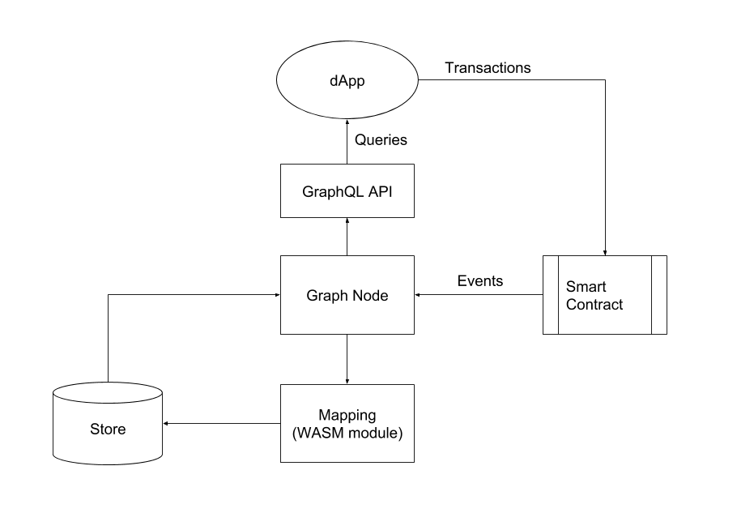

# Getting Started
> **Note:**  This project is heavily a WIP, and until it reaches v1.0, the API is subject to change in breaking ways without notice.

## 0 Introduction

This page explains everything you need to know to run a local Graph Node, including links to other reference pages. First, we describe what The Graph is and then explain how to get started.

### 0.1 What Is The Graph?

The Graph is a decentralized protocol for indexing and querying data from blockchains, which makes it possible to query for data that is difficult or impossible to do directly. Currently, we only work with Ethereum.

For example, with the popular Cryptokitties decentralized application (dApp) that implements the [ERC-721 Non-Fungible Token (NFT)](https://github.com/ethereum/eips/issues/721) standard, it is relatively straightforward to ask the following questions:
> *How many cryptokitties does a specific Ethereum account own?*
> *When was a particular cryptokitty born?*

These read patterns are directly supported by the methods exposed by the [contract](https://github.com/dapperlabs/cryptokitties-bounty/blob/master/contracts/KittyCore.sol): the [`balanceOf`](https://github.com/dapperlabs/cryptokitties-bounty/blob/master/contracts/KittyOwnership.sol#L64) and [`getKitty`](https://github.com/dapperlabs/cryptokitties-bounty/blob/master/contracts/KittyCore.sol#L91) methods for these two examples.

However, other questions are more difficult to answer:
> *Who are the owners of the cryptokitties born between January and February of 2018?*

To answer this question, you need to process all [`Birth` events](https://github.com/dapperlabs/cryptokitties-bounty/blob/master/contracts/KittyBase.sol#L15) and then call the [`ownerOf` method](https://github.com/dapperlabs/cryptokitties-bounty/blob/master/contracts/KittyOwnership.sol#L144) for each cryptokitty born. An alternate approach could involve processing all (`Transfer` events) and filtering based on the most recent transfer for each cryptokitty.

Even for this relatively simple question, it would take hours or even days for a dApp running in a browser to find an answer. Indexing and caching data off blockchains is hard. There are also edge cases around finality, chain reorganizations, uncled blocks, etc., which make it even more difficult to display deterministic data to the end user.

The Graph solves this issue by providing an open source node implementation, [Graph Node](../README.md), which handles indexing and caching of blockchain data. The entire community can contribute to and utilize this tool. In the current implementation, it exposes functionality through a GraphQL API for end users.

### 0.2 How Does It Work?

The Graph must be run alongside a running IPFS node, Ethereum node, and a store (Postgres, in this initial implementation).



The high-level dataflow for a dApp using The Graph is as follows:
1. The dApp creates/modifies data on Ethereum through a transaction to a smart contract.
2. The smart contract emits one or more events (logs) while processing this transaction.
3. The Graph Node listens for specific events and triggers handlers in a user-defined mapping.
4. The mapping is a WASM module that runs in a WASM runtime. It creates one or more store transactions in response to Ethereum events.
5. The store is updated along with the indexes.
6. The dApp queries the Graph Node for data indexed from the blockchain using the node's [GraphQL endpoint](https://graphql.org/learn/). The Graph Node, in turn, translates the GraphQL queries into queries for its underlying store to fetch this data. This makes use of the store's indexing capabilities.
7. The dApp displays this data in a user-friendly format, which an end-user leverages when making new transactions against the Ethereum blockchain.
8. And, this cycle repeats.

### 0.3 What's Needed to Build a Graph Node?
Three repositories are relevant to building on The Graph:
1. [Graph Node](../README.md) – A server implementation for indexing, caching, and serving queries against data from Ethereum.
2. [Graph CLI](https://github.com/graphprotocol/graph-tooling/tree/main/packages/cli) – A CLI for building and compiling projects that are deployed to the Graph Node.
3. [Graph TypeScript Library](https://github.com/graphprotocol/graph-tooling/tree/main/packages/ts) – TypeScript/AssemblyScript library for writing subgraph mappings to be deployed to The Graph.

### 0.4 Getting Started Overview
Below, we outline the required steps to build a subgraph from scratch, which will serve queries from a GraphQL endpoint. The three major steps are:

1. [Define the subgraph](#1-define-the-subgraph)
    1. [Define the data sources and create a manifest](#11-define-the-data-sources-and-create-a-manifest)

    2. [Create the GraphQL schema](#12-create-the-graphql-schema-for-the-data-source)

    3. [Create a subgraph project and generate types](#13-create-a-subgraph-project-and-generate-types)

    4. [Write the mappings](#14-writing-mappings)
2. Deploy the subgraph
    1. [Start up an IPFS node](#21-start-up-ipfs)

    2. [Create the Postgres database](#22-create-the-postgres-db)

    3. [Start the Graph Node and Connect to an Ethereum node](#23-starting-the-graph-node-and-connecting-to-an-ethereum-node)

    4. [Deploy the subgraph](#24-deploying-the-subgraph)
3. Query the subgraph
    1. [Query the newly deployed GraphQL API](#3-query-the-local-graph-node)

Now, let's dig in!

## 1 Define the Subgraph
When we refer to a subgraph, we reference the entire project that is indexing a chosen set of data.

To start, create a repository for this project.

### 1.1 Define the Data Sources and Create a Manifest

When building a subgraph, you must first decide what blockchain data you want the Graph Node to index. These are known as `dataSources`, which are datasets derived from a blockchain, i.e., an Ethereum smart contract.

The subgraph is defined by a YAML file known as the **subgraph manifest**. This file should always be named `subgraph.yaml`. View the full specification for the subgraph manifest [here](subgraph-manifest.md). It contains a schema, data sources, and mappings that are used to deploy the GraphQL endpoint.

Let's go through an example to display what a subgraph manifest looks like. In this case, we use the common ERC721 contract and look at the `Transfer` event because it is familiar to many developers. Below, we define a subgraph manifest with one contract under `dataSources`, which is a smart contract implementing the ERC721 interface:
```yaml
specVersion: 0.0.1
description: ERC-721 Example
repository: https://github.com/<YOUR_GITHUB_NAME>/erc721-example
schema:
  file: ./schema.graphql
dataSources:
- kind: ethereum/contract
  name: MyERC721Contract
  network: mainnet
  source:
    address: "0x06012c8cf97BEaD5deAe237070F9587f8E7A266d"
    abi: ERC721
  mapping:
    kind: ethereum/events
    apiVersion: 0.0.1
    language: wasm/assemblyscript
    entities:
    - Token
    abis:
    - name: ERC721
      file: ./abis/ERC721ABI.json
    eventHandlers:
    - event: Transfer(address,address,uint256)
      handler: handleTransfer
    file: ./mapping.ts
```
We point out a few important facts from this example to supplement the [subgraph manifest spec](subgraph-manifest.md):

* The name `ERC721` under `source > abi` must match the name displayed underneath `abis > name`.
* The event `Transfer(address,address,uint256)` under `eventHandlers` must match what is in the ABI. The name `handleTransfer` under `eventHandlers > handler` must match the name of the mapping function, which we explain in section 1.4.
* Ensure that you have the correct contract address under `source > address`. This is also the case when indexing testnet contracts as well because you might switch back and forth.
* You can define multiple data sources under dataSources. Within a datasource, you can also have multiple `entities` and `events`. See [this subgraph](https://github.com/graphprotocol/decentraland-subgraph/blob/master/subgraph.yaml) for an example.
* If at any point the Graph CLI outputs 'Failed to copy subgraph files', it probably means you have a typo in the manifest.

#### 1.1.1 Obtain the Contract ABIs  
The ABI JSON file must contain the correct ABI to source all the events or any contract state you wish to ingest into the Graph Node. There are a few ways to obtain an ABI for the contract:
* If you are building your own project, you likely have access to your most current ABIs of your smart contracts.
* If you are building a subgraph for a public project, you can download that project to your computer and generate the ABI by using [`truffle compile`](https://truffleframework.com/docs/truffle/overview) or `solc` to compile. This creates the ABI files that you can then transfer to your subgraph `/abi` folder.
* Sometimes, you can also find the ABI on [Etherscan](https://etherscan.io), but this is not always reliable because the uploaded ABI may be out of date. Make sure you have the correct ABI. Otherwise, you will not be able to start a Graph Node.

If you run into trouble here, double-check the ABI and ensure that the event signatures exist *exactly* as you expect them by examining the smart contract code you are sourcing. Also, note with the ABI, you only need the array for the ABI. Compiling the contracts locally results in a `.json` file that contains the complete ABI nested within the `.json` file under the key `abi`.

An example `abi` for the `Transfer` event is shown below and would be stored in the `/abi` folder with the name `ERC721ABI.json`:

```json
  [{
    "anonymous": false,
    "inputs": [
      {
        "indexed": true,
        "name": "_from",
        "type": "address"
      },
      {
        "indexed": true,
        "name": "_to",
        "type": "address"
      },
      {
        "indexed": true,
        "name": "_tokenId",
        "type": "uint256"
      }
    ],
    "name": "Transfer",
    "type": "event"
  }]
  ```

Once you create this `subgraph.yaml` file, move to the next section.

### 1.2 Create the GraphQL Schema for the Data Source
GraphQL schemas are defined using the GraphQL interface definition language (IDL). If you have never written a GraphQL schema, we recommend checking out a [quick primer](https://graphql.org/learn/schema/#type-language) on the GraphQL type system.

With The Graph, rather than defining the top-level `Query` type, you simply define entity types. Then, the Graph Node will generate top-level fields for querying single instances and collections of that entity type. Each entity type is required to be annotated with an `@entity` directive.

As you see in the example `subgraph.yaml` manifest above, it contains one entity named `Token`. Let's define what that would look like for the GraphQL schema:

Define a Token entity type:
```graphql
type Token @entity {
  id: ID!
  currentOwner: Address!
}
```

This `entity` tracks a single ERC721 token on Ethereum by its ID and the current owner. The **`ID` field is required** and stores values of the ID type, which are strings. The `ID` must be a unique value so that it can be placed into the store. For an ERC721 token, the unique ID could be the token ID because that value is unique to that coin.

The exclamation mark represents the fact that that field must be set when the entity is stored in the database, i.e., it cannot be `null`. See the [Schema API](https://github.com/graphprotocol/docs/blob/main/pages/en/querying/graphql-api.mdx#schema) for a complete reference on defining the schema for The Graph.

When you complete the schema, add its path to the top-level `schema` key in the subgraph manifest. See the code below for an example:

```yaml
specVersion: 0.0.1
schema:
  file: ./schema.graphql
```

### 1.3 Create a Subgraph Project and Generate Types
Once you have the `subgraph.yaml` manifest and the `./schema.graphql` file, you are ready to use the Graph CLI to set up the subgraph directory. The Graph CLI is a command-line tool that contains helpful commands for deploying the subgraphs. Before continuing with this guide, please go to the [Graph CLI README](https://github.com/graphprotocol/graph-tooling/tree/main/packages/cli) and follow the instructions up to Step 7 for setting up the subgraph directory.

Once you run `yarn codegen` as outlined in the [Graph CLI README](https://github.com/graphprotocol/graph-tooling/tree/main/packages/cli), you are ready to create the mappings.

`yarn codegen` looks at the contract ABIs defined in the subgraph manifest and generates TypeScript classes for the smart contracts the mappings script will interface with, which includes the types of public methods and events. In reality, the classes are AssemblyScript but more on that later.

Classes are also generated based on the types defined in the GraphQL schema. These generated classes are incredibly useful for writing correct mappings. This allows you to autocomplete Ethererum events as well as improve developer productivity using the TypeScript language support in your favorite editor or IDE.

### 1.4 Write the Mappings

The mappings that you write will perform transformations on the Ethereum data you are sourcing, and it will dictate how this data is loaded into the Graph Node. Mappings can be very simple but can become complex. It depends on how much abstraction you want between the data and the underlying Ethereum contract.

Mappings are written in a subset of TypeScript called AssemblyScript, which can be compiled down to WASM. AssemblyScript is stricter than normal TypeScript but follows the same backbone. A few TypeScript/JavaScript features that are not supported in AssemblyScript include plain old Javascript objects (POJOs), untyped arrays, untyped maps, union types, the `any` type, and variadic functions. In addition, `switch` statements also work differently. See the [AssemblyScript wiki](https://github.com/AssemblyScript/assemblyscript/wiki) for a full reference on AssemblyScript features.

In the mapping file, create export functions named after the event handlers in the subgraph manifest. Each handler should accept a single parameter called `event` with a type corresponding to the name of the event that is being handled. This type was generated for you in the previous step, 1.3.

```typescript
export function handleTransfer(event: Transfer): void {
  // Event handler logic goes here
}
```

As mentioned, AssemblyScript does not have untyped maps or POJOs, so classes are generated to represent the types defined in the GraphQL schema. The generated type classes handle property type conversions for you, so AssemblyScript's requirement of strictly typed functions is satisfied without the extra work of converting each property explicitly.

Let's look at an example. Continuing with our previous token example, let's write a mapping that tracks the owner of a particular ERC721 token.

```typescript

// This is an example event type generated by `graph-cli`
// from an Ethereum smart contract ABI
import { Transfer } from './types/abis/SomeContract'

// This is an example of an entity type generated from a
// subgraph's GraphQL schema
import { Token } from './types/schema'

export function handleTransfer(event: Transfer): void {
    let tokenID = event.params.tokenID.toHex()
    let token = new Token(tokenID)
    token.currentOwner = event.params.to

    token.save()
}
```
A few things to note from this code:
* We create a new entity named `token`, which is stored in the Graph Node database.
* We create an ID for that token, which must be unique, and then create an entity with `new Token(tokenID)`. We get the token ID from the event emitted by Ethereum, which was turned into an AssemblyScript type by the [Graph TypeScript Library](https://github.com/graphprotocol/graph-tooling/tree/main/packages/ts). We access it at `event.params.tokenId`. Note that you must set `ID` as a string and call `toHex()` on the `tokenID` to turn it into a hex string.
* This entity is updated by the `Transfer` event emitted by the ERC721 contract.
* The current owner is gathered from the event with `event.params.to`. It is set as an Address by the Token class.
* Event handlers functions always return `void`.
* `token.save()` is used to set the Token entity. `.save()` comes from `graph-ts` just like the entity type (`Token` in this example). It is used for setting the value(s) of a particular entity's attribute(s) in the store. There is also a `.load()` function, which will be explained in 1.4.1.

#### 1.4.1 Use the `save`, `load`, and `remove` entity functions

The only way that entities may be added to The Graph is by calling `<entity>.save()`, which may be called multiple times in an event handler. `<entity>.save()` will only set the entity attributes that have explicitly been set on the `entity`. Attributes that are not explicitly set or are unset by calling `Entity.unset(<attribute>)` will not be overwritten. This means you can safely update one field of an entity and not worry about overwriting other fields not referenced in the mapping.

The definition for `<entity>.save()` is:

```typescript
entity.save() // Entity is representative of the entity type being updated. In our example above, it is Token.
```

 `<entity>.load()` expects the entity type and ID of the entity. Use `<entity>.load()` to retrieve information previously added with `<entity>.save()`.

The definition for `<entity>.load()` is:

 ```typescript
entity.load() // Entity is representative of the entity type being updated. In our example above, it is Token.
```

Once again, all these functions come from the [Graph TypeScript Library](https://github.com/graphprotocol/graph-tooling/tree/main/packages/ts).

Let's look at the ERC721 token as an example for using `token.load()`. Above, we showed how to use `token.save()`. Now, let's consider that you have another event handler that needs to retrieve the currentOwner of an ERC721 token. To do this within an event handler, you would write the following:

```typescript
  let token = token.load(tokenID.toHex())
  if (token !== null) {
    let owner = token.currentOwner
  }
```

You now have the `owner` data, and you can use that in the mapping to set the owner value to a new entity.

There is also `<entity>.remove()`, which allows you to erase an entry that exists in the store. You simply pass the entity and ID:

```typescript
entity.remove(ID)
```

#### 1.4.2 Call into the Contract Storage to Get Data

You can also obtain data that is stored in one of the included ABI contracts. Any state variable that is marked `public` or any `view` function can be accessed. Below shows how you obtain the token
symbol of an ERC721 token, which is a state variable of the smart contract. You would add this inside of the event handler function.  

```typescript
  let tokenContract = ERC721.bind(event.address);
  let tokenSymbol = tokenContract.symbol();
```

Note, we are using an ERC721 class generated from the ABI, which we call bind on. This is gathered from the subgraph manifest here:
```yaml
  source:
    address: "0x06012c8cf97BEaD5deAe237070F9587f8E7A266d"
    abi: ERC721
```

The class is imported from the ABI's TypeScript file generated via `yarn codegen`.

## 2 Deploy the Subgraph

### 2.1 Start Up an IPFS Node
To deploy the subgraph to the Graph Node, the subgraph will first need to be built and stored on IPFS, along with all linked files.

To run an IPFS daemon locally, execute the following:
1. Download and install IPFS.
2. Run `ipfs init`.
3. Run `ipfs daemon`.

If you encounter problems, follow the instructions from the [IPFS website](https://ipfs.io/docs/getting-started/).

To confirm the subgraph is stored on IPFS, pass that subgraph ID into `ipfs cat` to view the subgraph manifest with file paths replaced by IPLD links.

### 2.2 Create the Postgres database

Ensure that you have Postgres installed. Navigate to a location where you want to save the `.postgres` folder. The desktop is fine since this folder can be used for many different subgraphs. Then, run the following commands:

```
initdb -D .postgres
pg_ctl -D .postgres -l logfile start
createdb <POSTGRES_DB_NAME>
```
Name the database something relevant to the project so that you always know how to access it.

### 2.3 Start the Graph Node and Connect to an Ethereum Node

When you start the Graph Node, you need to specify which Ethereum network it should connect to. There are three common ways to do this:
 * Infura
 * A local Ethereum node
 * Ganache

The Ethereum Network (Mainnet, Ropsten, Rinkeby, etc.) must be passed as a flag in the command that starts the Graph Node as laid out in the following subsections.

#### 2.3.1 Infura

[Infura](https://infura.io/) is supported and is the simplest way to connect to an Ethereum node because you do not have to set up your own geth or parity node. However, it does sync slower than being connected to your own node. The following flags are passed to start the Graph Node and indicate you want to use Infura:

```sh
cargo run -p graph-node --release -- \
  --postgres-url postgresql://<USERNAME><:PASSWORD>@localhost:5432/<POSTGRES_DB_NAME> \
  --ethereum-rpc <ETHEREUM_NETWORK_NAME>:https://mainnet.infura.io \
  --ipfs 127.0.0.1:5001 \
  --debug
```

Also, note that the Postgres database may not have a password at all. If that is the case, the Postgres connection URL can be passed as follows:

`  --postgres-url postgresql://<USERNAME>@localhost:5432/<POSTGRES_DB_NAME> \ `

#### 2.3.2 Local Geth or Parity Node

This is the speediest way to get mainnet or testnet data. The problem is that if you do not already have a synced [geth](https://geth.ethereum.org/docs/getting-started) or [parity](https://github.com/paritytech/parity-ethereum) node, you will have to sync one, which takes a very long time and takes up a lot of space. Additionally, note that geth `fast sync` works. So, if you are starting from scratch, this is the fastest way to get caught up, but expect at least 12 hours of syncing on a modern laptop with a good internet connection to sync geth. Normal mode geth or parity will take much longer. Use the following geth command to start syncing:

`geth --syncmode "fast" --rpc --ws --wsorigins="*" --rpcvhosts="*" --cache 1024`

Once you have the local node fully synced, run the following command:

```sh
cargo run -p graph-node --release -- \
  --postgres-url postgresql://<USERNAME><:PASSWORD>@localhost:5432/<POSTGRES_DB_NAME> \
  --ethereum-rpc <ETHEREUM_NETWORK_NAME>:127.0.0.1:8545 \
  --ipfs 127.0.0.1:5001 \
  --debug
```

This assumes the local node is on the default `8545` port. If you are on a different port, change it.

Switching back and forth between sourcing data from Infura and your own local nodes is fine. The Graph Node picks up where it left off.

#### 2.3.3 Ganache

**IMPORTANT: Ganache fixed the [issue](https://github.com/trufflesuite/ganache/issues/907) that prevented things from working properly. However, it did not release the new version. Follow the steps in this [issue](https://github.com/graphprotocol/graph-node/issues/375) to run the fixed version locally.**

[Ganache](https://github.com/trufflesuite/ganache-cli) can be used as well and is preferable for quick testing. This might be an option if you are simply testing out the contracts for quick iterations. Of course, if you close Ganache, then the Graph Node will no longer have any data to source. Ganache is best for short-term projects such as hackathons. Also, it is useful for testing to see that the schema and mappings are working properly before working on the mainnet.

You can connect the Graph Node to Ganache the same way you connected to a local geth or parity node in the previous section, 2.3.2. Note, however, that Ganache normally runs on port `9545` instead of `8545`.

#### 2.3.4 Local Parity Testnet

To set up a local testnet that will allow you to rapidly test the project, download the parity software if you do not already have it.

This command will work for a one-line install:

`bash <(curl https://get.parity.io -L)`

Next, you want to make an account that you can unlock and make transactions on for the parity dev chain. Run the following command:

`parity account new --chain dev`

Create a password that you will remember. Take note of the account that gets output. Now, you also have to make that password a text file and pass it into the next command. The desktop is a good location for it. If the password is `123`, only put the numbers in the text file. Do not include any quotes.

Then, run this command:

`parity --config dev --unsafe-expose --jsonrpc-cors="all" --unlock <ACCOUNT_ADDRESS> --password ~/Desktop/password.txt`

The chain should start and will be accessible by default on `localhost:8545`. It is a chain with 0 block time and instant transactions, making testing very fast. Passing `unsafe-expose` and `--jsonrpc-cors="all"` as flags allows MetaMask to connect. The `unlock` flag gives parity the ability to send transactions with that account. You can also import the account to MetaMask, which allows you to interact with the test chain directly in your browser. With MetaMask, you need to import the account with the private testnet Ether. The base account that the normal configuration of parity gives you is
`0x00a329c0648769A73afAc7F9381E08FB43dBEA72`.

The private key is:
```
4d5db4107d237df6a3d58ee5f70ae63d73d7658d4026f2eefd2f204c81682cb7 (note this is the private key given along with the parity dev chain, so it is okay to share)
```
Use MetaMask ---> import account ---> private key.

All the extra information for customization of a parity dev chain is located [here](https://wiki.parity.io/Private-development-chain#customizing-the-development-chain).

You now have an Ethereum account with a ton of Ether and should be able to set up the migrations on this network and use Truffle. Now, send some Ether to the previous account that was created and unlocked. This way, you can run `truffle migrate` with this account.

#### 2.3.5 Syncing with a Public Testnet

If you want to sync using a public testnet such as Kovan, Rinkeby, or Ropsten, just make sure the local node is a testnet node or that you are hitting the correct Infura testnet endpoint.

### 2.4 Deploy the Subgraph

When you deploy the subgraph to the Graph Node, it will start ingesting all the subgraph events from the blockchain, transforming that data with the subgraph mappings and storing it in the Graph Node. Note that a running subgraph can safely be stopped and restarted, picking up where it left off.

Now that the infrastructure is set up, you can run `yarn create-subgraph` and then `yarn deploy` in the subgraph directory. These commands should have been added to `package.json` in section 1.3 when we took a moment to go through the set up for [Graph CLI documentation](https://github.com/graphprotocol/graph-tooling/tree/main/packages/cli). This builds the subgraph and creates the WASM files in the `dist/` folder. Next, it uploads the `dist/
` files to IPFS and deploys it to the Graph Node. The subgraph is now fully running.

The `watch` flag allows the subgraph to continually restart every time you save an update to the `manifest`, `schema`, or `mappings`. If you are making many edits or have a subgraph that has been syncing for a few hours, leave this flag off.

Depending on how many events have been emitted by your smart contracts, it could take less than a minute to get fully caught up. If it is a large contract, it could take hours. For example, ENS takes about 12 to 14 hours to register every single ENS domain.

## 3 Query the Local Graph Node
With the subgraph deployed to the locally running Graph Node, visit http://127.0.0.1:8000/ to open up a [GraphiQL](https://github.com/graphql/graphiql) interface where you can explore the deployed GraphQL API for the subgraph by issuing queries and viewing the schema.

We provide a few simple examples below, but please see the [Query API](https://github.com/graphprotocol/docs/blob/main/pages/en/querying/graphql-api.mdx#queries) for a complete reference on how to query the subgraph's entities.

Query the `Token` entities:
```graphql
{
  tokens(first: 100) {
    id
    currentOwner
  }
}
```
Notice that `tokens` is plural and that it will return at most 100 entities.

Later, when you have deployed the subgraph with this entity, you can query for a specific value, such as the token ID:

```graphql
{
  token(first: 100, id: "c2dac230ed4ced84ad0ca5dfb3ff8592d59cef7ff2983450113d74a47a12") {
    currentOwner
  }
}
```

You can also sort, filter, or paginate query results. The query below would organize all tokens by their ID and return the current owner of each token.

```graphql
{
  tokens(first: 100, orderBy: id) {
    currentOwner
  }
}
```

GraphQL provides a ton of functionality. Once again, check out the [Query API](graphql-api.md#1-queries) to find out how to use all supported query features.

## 4 Changing the Schema, Mappings, and Manifest, and Launching a New Subgraph

When you first start building the subgraph, it is likely that you will make a few changes to the manifest, mappings, or schema. If you update any of them, rerun `yarn codegen` and `yarn deploy`. This will post the new files on IPFS and deploy the new subgraph. Note that the Graph Node can track multiple subgraphs, so you can do this as many times as you like.

## 5 Common Patterns for Building Subgraphs

### 5.1 Removing Elements of an Array in a Subgraph

Using the AssemblyScript built-in functions for arrays is the way to go. Find the source code [here](https://github.com/AssemblyScript/assemblyscript/blob/18826798074c9fb02243dff76b1a938570a8eda7/std/assembly/array.ts). Using `.indexOf()` to find the element and then using `.splice()` is one way to do so. See this [file](https://github.com/graphprotocol/aragon-subgraph/blob/master/individual-dao-subgraph/mappings/ACL.ts) from the Aragon subgraph for a working implementation.

### 5.2 Getting Data from Multiple Versions of Your Contracts

If you have launched multiple versions of your smart contracts onto Ethereum, it is very easy to source data from all of them. This simply requires you to add all versions of the contracts to the `subgraph.yaml` file and handle the events from each contract. Design your schema to consider both versions, and handle any changes to the event signatures that are emitted from each version. See the [0x Subgraph](https://github.com/graphprotocol/0x-subgraph/tree/master/src/mappings) for an implementation of multiple versions of smart contracts being ingested by a subgraph.

## 5 Example Subgraphs

Here is a list of current subgraphs that we have open sourced:
* https://github.com/graphprotocol/ens-subgraph
* https://github.com/graphprotocol/decentraland-subgraph
* https://github.com/graphprotocol/adchain-subgraph
* https://github.com/graphprotocol/0x-subgraph
* https://github.com/graphprotocol/aragon-subgraph
* https://github.com/graphprotocol/dharma-subgraph
* https://github.com/daostack/subgraph
* https://github.com/graphprotocol/dydx-subgraph
* https://github.com/livepeer/livepeerjs/tree/master/packages/subgraph
* https://github.com/graphprotocol/augur-subgraph

## Contributions

All feedback and contributions in the form of issues and pull requests are welcome!

